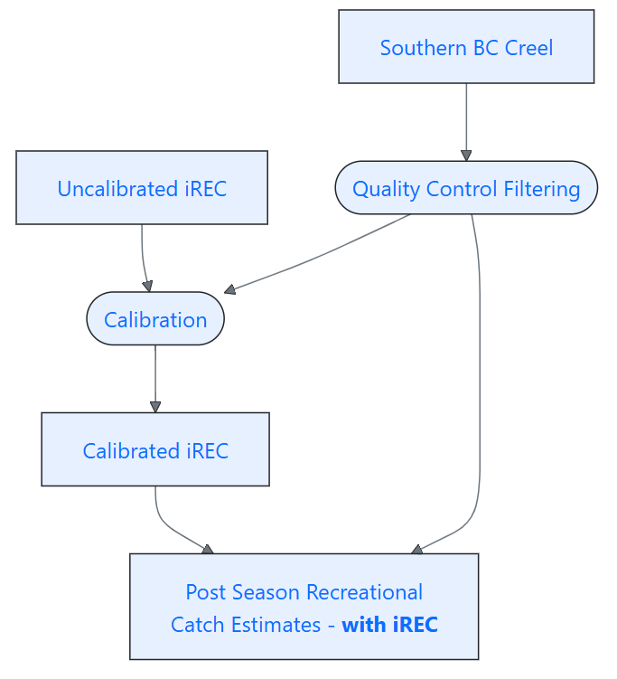
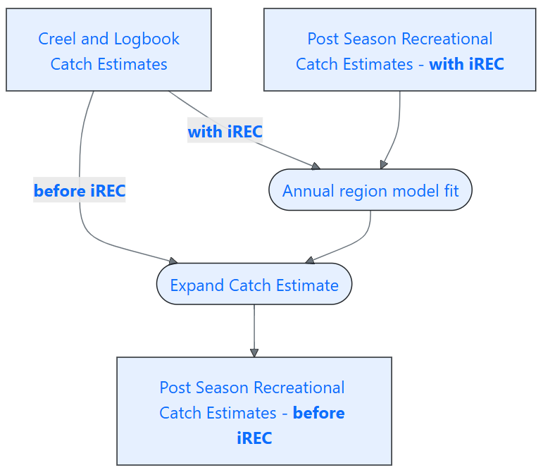

---
output:
  pdf_document: default
  html_document: default
---

# Methods

## Revised Chinook catch estimates with iREC

Since the introduction of iREC in 2013, there have been different methods used to combine Chinook catch information from creel surveys, logbooks, and iREC to produce recreational catch estimates. The primary purpose of revising recreational catch estimates is to incorporate the different sources of catch into a single standardized set of recreational catch estimates for all Pacific Region marine waters.

### Background on survey methods

We first provide a brief background on the regionally-specific creel and logbook programs, coast-wide iREC reporting, and how each contribute to Chinook catch estimates in a given month. More details on each method can be found in relevant technical reports (e.g., [@sturhahn2001; @english2002; @korman2005evaluation]). We note any improvements to the data quality assurance and control that occurred in order to create the data sets used in this analysis. While all methods report on multiple species, here we are concerned only with data related to Chinook salmon. The coastal area of interest is all Pacific Fishery Management Areas [PFMAs, Figure \@ref(fig:fig-PFMA), @pfma_2007], more information and detailed maps can be found on the DFO website ^[https://www.pac.dfo-mpo.gc.ca/fm-gp/maps-cartes/areas-secteurs/index-eng.html].

```{r myfigure, echo=FALSE, message=FALSE, warning=FALSE, out.width="70%"}
#| label: fig-PFMA
#| fig-cap: "Pacific Fishery Management Areas"

fig1_path <- "data/PFMA.png"

knitr::include_graphics(c(fig1_path))

```

#### South Coast Catch Estimation

South Coast catch estimation is a combination of creel surveys and logbooks from both guides and avid angler programs. The South Coast Creel Survey (SCCS), run by DFO, began in the early 1980s and was limited to Strait of Georgia recreational fisheries. It has since expanded in scope to survey PFMAs 10 to 27, including offshore areas (those with PFMA IDs in the 100s). The surveys are generally conducted in the summer months, however some spring and fall surveys occur in specific areas. The survey involves dock-side fisher interviews to capture catch rates and aerial surveys for effort counts. Raw estimates and uncertainty are expanded to cover a given month and area (typically PFMA). Currently, this program estimates the following:

-   Sub-legal sized released catch
-   Legal sized released catch based on adipose-clip status (e.g., clipped/marked and unclipped/unmarked)
-   Legal sized kept catch based on adipose-clip status (e.g., clipped/marked and unclipped/unmarked)

In the past, kept catch with unknown adipose clip status were split into marked and unmarked catch using a monthly mark rate and to kept and released using a monthly release rate. For more information and methods about the SCCS, see the most recent program overview and bulletins [e.g. @scab2024]. While the SCCS is the primary source of data for the South Coast, logbook data from guides and avid angler programs are provided on a voluntary basis and are removed from area and month-specific estimates of the creel survey to avoid double-counting.

##### South Coast Creel Survey quality control

Since the SCCSs vary in sampling intensity and spatial-temporal coverage, we have introduced systematic quality control of these estimates. Following the method used for iREC calibration to creel [@irec_sar_2015], we filter the creel estimates based on quality control criteria in a given area and month. These quality control criteria are designed to avoid uncertainty associated with monthly estimate based on only a small number of days or biases when estimates are based on only a certain type of day (e.g., weekends). Each area and monthly creel estimate included in our data was required to meet each of the following criteria:

-   At least three flights for each type of day (weekday or weekend)
-   At least 25 interviews on weekdays OR at least 10% of interviews from weekdays
-   At least 25 interviews on weekends OR at least 10% of interviews from weekends
-   At least a 15 day spread in flights
-   At least a 15 day spread in interviews

These criteria exclude 51% of all estimates since 2005 (Figure \@ref(fig:fig-creel-criteria)).  This criteria excludes areas that are not targeted and not estimaetd by the southcoast creel survey, include PFMA 10, 26, and 126.  Of the PFMAs with estimates that both pass and fail the criteria, PFMA 15 and 16 have the highest proportion that fail the criteria, followed by Area 29 (Marine), 19 (Strait of Georgia, GS), and 21, which all have over 80% of estimates fail the criteria. The core summer months of July and August have the highest rate of estimates passing the criteria (> 70%), whereas more than 75% of estimates from the winter months (October through February) fail the criteria, likely due to weather making consistent overflights difficult. We refer to the creel estimates that pass this quality control as "filtered creel".


\begin{landscapepage}

```{r methods Loading packages useful functions, message=FALSE, warning=FALSE, results='hide', echo=FALSE}

col1 = "#e0ecf4"
col2 = "#0570b0"
col3 = "lightblue"
col4 = "lightblue4"
col5 = "#fddbc7"
col6 = "#cb181d"
col7 = "purple"
col8 = "purple4"
colclear= "#1C00ff00"

```

```{r methods plotting PFMA creel unfiltered, echo=FALSE, message=FALSE, warning=FALSE, fig.height=18, fig.width=15, fig.align="left", out.width="9in"}
#| label: fig-creel-criteria
#| fig-cap: "South Coast creel estimates that passed (blue) or failed (red) quality control criteria by month and PFMA."

creel_month_PFMA <- pacRecCatch::filter_creel_catch("pacRecCatch_db.yaml")
Creel_month_PFMA_failed <- 
  creel_month_PFMA  |>
  filter(criteria == "failed") |>
  mutate(across(where(is.numeric), ~na_if(., 0)),
         area = if_else(area == "29", "29 (Marine)", area)) |>  
  filter(area %notin% c("3", "4"))


Creel_month_PFMA_passed <- 
  creel_month_PFMA |>
  filter(criteria == "passed") |>
  mutate(across(where(is.numeric), ~na_if(., 0))) |>
  filter(area %notin% c("3", "4"))

ggplot() +
  geom_tile(data=Creel_month_PFMA_passed, aes(x=year, y=as.factor(month), fill = val),colour = "white") +
  scale_fill_gradient(low = col1, high = col2,  na.value = colclear, limits=c(0,20000)) +
  scale_y_discrete(limits=rev)+
  guides(fill=guide_legend(title="Creel estimates that passed criteria")) +
  new_scale_fill() +
  geom_tile(data=Creel_month_PFMA_failed, aes(x=year, y=as.factor(month), fill = val),colour = "white") +
  scale_fill_gradient(low = col5, high = col6,  na.value = colclear, limits=c(0,20000))+
  facet_wrap(~area, ncol = 6)+
  guides(fill=guide_legend(title="Creel estimates that failed criteria")) +
  labs(title = "Coverage by PFMA", x = "Year", y = "Month") +
  theme_minimal() + 
  #making the text bigger
  theme(
    legend.position="bottom",
    strip.text = element_text(size = 12), #facet wrap labels
    plot.title = element_text(size = 18, face = "bold"),
    axis.title.x = element_text(size = 14), # x-axis title
    axis.title.y = element_text(size = 17),  # y-axis title
    legend.text = element_text(size = 13),
    axis.text.y = element_text(size = 8),# make y axis bigger,
    plot.margin = margin(2, 2, 2, 2)
  )

```

\end{landscapepage}

#### Central Coast Catch Estimation

Central Coast catch estimation is exclusively logbook data from lodges. The PFMAs included in the Central Coast are 6, 7, 8, 9, 10, and their offshore counterparts 106, 107, 108, 109, and 110. These data are not typically by marked and kept status, so those distinctions need to be reconstructed using mark rate and release rates. Although not all lodges provide logbook catch data, the catch data has historically been reported as the total catch for the region. This was identified as a bias in the recreational catch estimates that the inclusion of iREC would address. In addition, the Central Coast Indigenous Resource Alliance is currently developing a new creel monitoring program which may be a potential source of data to improve catch estimates in portions of PFMA 6 to 10.

#### North Coast Catch Estimation

Northern British Columbia (NBC) recreational catch monitoring generally aligns with two distinct regions, Haida Gwaii (i.e. NBC aggregate abundance based management) and NBC individual stock-based management (ISBM). A combination of independently-run creel programs and logbook data programs are used to monitor each of these regions.

Haida Gwaii covers the marine waters consisting of PFMAs 1, 2 (East and West), 101, 102, and 142. Recreational catch monitoring is carried out using a combination of a creel program run by the Haida Nation and lodge-submitted logbooks. The creel program has operated since 1999 and typically operates from late May to the middle of September. Lodges represent the majority of the catch around Haida Gwaii, particularly around the northern portion in PFMA 1/101. As the logbook program does not capture release data, the creel program data has historically been used to estimate releases from both lodge and non-lodge catch.

The NBC ISBM fishery is monitored by both a Skeena creel program [@robichaud2025creel] and a logbook program run by DFO in PFMAs 3/103 and 4/104. It is unclear how the creel program was operated from 2005 to 2007, however DFO conducted the program from 2008 to 2014 and the North Coast Skeena First Nations Stewardship Society has conducted the program since 2015. Before 2019, the Skeena creel program covered June to August. Since 2019, coverage has been extended to include the May and September long weekends. Creel estimates are corrected for vessels to provide logbook data allowing the two catch sources to be combined.  For this analysis, we include PFMA 5/105 in NBC ISBM. However, the area is more remote and has limited catch monitoring data. As in the Central Coast, logbook data are not typically collected by marked and kept status so those distinctions need to be reconstructed using mark rates and release rates.

#### Internet Recreational Effort and Catch (iREC) Reporting Program

The Internet Recreational Effort and Catch (iREC) reporting program is used to develop catch estimates for all tidal waters in Canada’s Pacific Region. Recreational fishing in the Pacific Region requires a Tidal Waters Sport Fishing Licence which have been sold predominantly online since roughly 2010. Several types of licences are sold, distinguished by:

 - *Term Length:* Annual (valid from purchase date until March 31) or term (1, 3, or 5 days)
 - *Residency:* Canadian or non-Canadian
 - *Age:* Juvenile, Adult, or Senior
 
For this program, recreational licence holders are selected to report online, for one assigned month of their licence term, a detailed record of their fishing activity and catch. Reporting is mandatory but for various reasons not all fishers complete the report; completion rates are typically 50-55%. Using the completed reports, estimates of the total kept and released catch, by mark status are developed for each month and PFMA. Uncorrected estimates are developed by expanding the average monthly catch per licence by the number of licences eligible to fish in that month. These calculations are stratified by licence type to protect against bias due to differential fishing and reporting rates by licence type. Bias correction factors, described in the section below, are then applied to generate bias-corrected iREC estimates. The iREC program operation and analytical methodology was initially reviewed at a 2015 Canadian Science Advisory Secretariat (CSAS) regional peer review. The main report stemming from that meeting is the associated Science Advisory Report [@irec_sar_2015]. Appendix \@ref(apdx-irec-mthd) details changes to the methodology that have been made since the initial reviewed version, along with some summaries of the realized sample sizes.

#### iREC to Creel Calibration

iREC catch estimates are bias corrected by scaling estimates using the slope $m$ of regressions between monthly iREC and corresponding creel estimates for angling by boat in each area. Specifically, calibrated iREC point estimates ($iREC^{*}$) of boat-based angling catch are calculated from uncalibrated estimates ($iREC$) as:

$$
iREC^{*}= creel = \frac{(iREC)}{m}
\label{eq:irec_calibration}
$$

The calibration coefficient $m$ is estimated annually using all area and month estimates of creel that are of appropriate quality based on the criteria identified in the "South Coast Creel Survey quality control" section of this document. Separate calibration factors are estimated for total kept and released catch, by species, for angling by boat. As both the creel and iREC estimates have uncertainty associated with them, an error-in-variables approach is used to estimate $m$ using JAGS [@plummer2003jags] through the `rjags` R package [@rjags]. The specific model code used is provided below, with `creel.obs` representing the creel estimate, `creel.se` representing the standard error of the creel estimate, and `iRec.obs` representing the iREC uncalibrated catch estimate for the same area and time as the creel estimate. The calibartion factors are used to correct both angling by boat and angling from shore catch estiamtes.  

```{r methods jags, echo=TRUE}
model.jags <- function() {   
  for(i in 1:Ndata) {      
    #generate what true value may be based on se (notice that dnorm in jags      
    # uses 1/variance for second argument thus 1/SE^2)      
    creel.true[i] ~ dnorm(creel.obs[i], 1/creel.se[i]*1/creel.se[i])            
    #now for the actual regression equation     
    mu[i] <- beta1 * creel.true[i]      
    iRec.obs[i] ~ dnorm(mu[i], tau)   
  }      
  beta1 ~ dnorm(0, 0.0001)   
  tau ~ dgram(0.01, 0.01) 
  #a common prior for a variance term in vertical direction     
  #derived variables   
  sigma <- 1/sqrt(tau) 
  #std deviation about the regression line
}
```

### Combining survey methods for best catch estimates

In the past, iREC was incorporated into catch estimates in various ways, including an area-specific infilling method for South Coast areas, and at higher stratification level for the CTC's reporting. Neither of these methods were robust or systematic approaches to incorporating iREC at the finest scale possible. Here, we outline a systematic method for combining survey methods to obtain the best kept and released catch estimates in a given month and PFMA by adipose-clip status.

We pulled raw recreational catch data from DFO's Catch and Release Estimates (CREST) database, which stores creel, logbook, and iREC data for both marine and freshwater regions. The data was filtered to only marine estimates of legal-sized marked and unmarked fish that were kept or released. Northern BC (creel and logbook estimates 2005-2023) and Central BC (logbook only estimates 2022-2023) catch estimates were incomplete in CREST for these regions. We filtered CREST catch data to only South Coast creel, as described above, to only include higher quality creel estimates. These estimates (which do not include logbook data) were then augmented with logbook data where available (e.g., logbook and creel estimates were summed).

We assembled and combined recreational Chinook catch data by developing the `pacRecCatch` R package (@pacRecCatch). This package has several functions to pull data from CREST and load in other sources manually. The package has functions that subsequently clean, filter, align, and combine the various survey methods to the final data set as described below.


#### Catch Stratification

Appendix \@ref(apdx-strattab) presents the stratification of fisheries by PFMA and partial PFMAs, organized by monthly ranges used for catch estimation. The CTC Exploitation Rate Analysis (ERA) fisheries are the fishery definitions that the CTC reports to estimate stock-specific exploitation rates [@CTC1988]. 

To support consolidated recreational catch estimates and meet Treaty obligations, particularly those involving mark-selective fisheries, Canada recently reorganized the fishery stratification levels used by the CTC.  Within the CTC ERA, finescale fisheries are used to define the component fisheries used to represent the final estimated ERA fishery.  The newer Canadian finescale fisheries are based on PFMAs and seasons that support the integration of marked and unmarked release rates that spatially represent either all or part of an ERA fishery.

#### Alignment Issues

iREC and creel both generally align spatially to PFMA [@pfma_2007], with some areas split to support unique local conditions. However, there are a few areas that were initially not split by the iREC system into their component parts, as is done in creel estimates. Some of the splits, such PFMA 2 and 20 (which are both sometimes split into an east and west portion) are combined for this analysis. PFMA 29 was not split into marine and tidal waters in the earlier years of iREC and resulting PFMA 29 catch was treated as all marine catch for this analysis. Later years of iREC provided the marine and tidal separation. In these cases, we limit the analysis to just the marine portion of the PFMA. For PFMA 19 and 23, we combine creel data from 2013 until the split was incorporated into iREC in licence year 2014. Although all these splits are used to improve the quality of estimates from the creel program, the collapsing of these splits are not anticipated to substantially affect the relationship between iREC and creel catch estimates.

### Extrapolating catch with unknown adipose-clip status

All data is typically collected in number of marked and unmarked fish kept and released. However, when mark status is unknown, catch estimates can be provided as kept and released catch with unknown mark status. We extrapolate these unknown mark status estimates to marked and unmarked catch using mark rate of the known catch.

The creel data estimation only started estimating catch by adipose clip status in 2009. Before 2009, Chinook catch was estimated only for kept and released. To utilize the mark rate data collected by creel surveys from 2005 to 2008, the sample data were specifically loaded for south coast areas and used to split both kept and released catch by mark status for each year, month, and area combination.

We calculate mark rate in a number of different ways and prioritize the assignment of mark rate in the following order:

1.  Monthly area calculation - Mark rate calculated for a given source (iREC, creel, or logbook) within a given year, month, and area
2.  Monthly average by source - Mark rate calculated within a given year, month, and area, averaged across sources
3.  Monthly regional average - Mark rate calculated for a given source within a given year, month, and region (averaged across areas within a region)
4.  Seasonal area average - Mark rate calculated for a given source (iREC, creel, or logbook) within a given year, season, and area
5.  Seasonal regional average - Mark rate calculated for a given source within a given year, season, and region
6.  Monthly area average across years - Mark rate calculated for a given source within a given month, area, and across years
7.  Monthly regional average across years - Mark rate calculated for a given source within a given month, region, and across years

### Choosing best monthly catch estimate per PFMA

We use the following rules to choose the best catch estimate between creel (augmented with logbook data) and calibrated iREC:

For Southern BC:

-   In months May-September (5-9) use creel + logbook if creel data passes quality control rules, otherwise use calibrated iREC
-   In months outside of 5-9, use calibrated iREC

For Northern and Central BC:

-   Use calibrated iREC from 2015 onwards

In Southern BC, these rules prioritize quality-controlled creel estimates during the summer months, when most creel survey effort is concentrated, and prioritizes calibrated iREC data during shoulder seasons and anywhere there is a gap in creel coverage.


```{r methods with irec flowchart, out.width="65%", results='asis', echo=FALSE}
#| label: fig-area-catch-process
#| fig-cap: "Diagram showing the steps to identifying the best avaiable catch in Southern BC between creel and iREC from 2013 onward."



```

Northern and Central BC do not have consistent standardized creel, and therefore the iREC data is preferred over logbook-only data. iREC took longer to achieve effective sample rates in Northern BC and therefore data from 2015 onward is used.

In Figure \@ref(fig:fig-creel-irec-NGS) we demonstrate how iREC fills in the gaps in each PFMA for the Northern Strait of Georgia finescale fishery.


\begin{landscapepage}

```{r methods pfma_month again, message=FALSE, warning=FALSE, results='hide', echo=FALSE}

pfma_yearMonth <- 
  sport_catch_area |>
  group_by(year, month, area, region, finescale_fishery) |>
  summarise(sum_creel = sum(creel, na.rm = TRUE), 
            sum = sum(creel_plus, na.rm = TRUE), 
            sum_historic = sum(historic_plus, na.rm = TRUE), 
            sum_catch_estimate = sum(catch_estimate, na.rm = TRUE), 
            sum_irec = sum(irec_calibrated, na.rm = TRUE),
            .groups = "drop") |>
  mutate(across(where(is.double), ~na_if(., 0)))

pfma_yearMonth_catch_estimate_1 <- 
  pfma_yearMonth  |>
  filter(sum_catch_estimate != sum, 
         sum_catch_estimate != sum_historic, 
         sum_catch_estimate != sum_irec)

pfma_yearMonth_irec_1 <-
  pfma_yearMonth |> 
  filter(sum_catch_estimate == sum_irec)
```


```{r methods plotting PFMA - Northern Strait of Georgia, echo=FALSE, message=FALSE, warning=FALSE, fig.height=18, fig.width=15, fig.align="left", out.width="9in"}
#| label: fig-creel-irec-NGS
#| fig-cap: "Creel estimates in Northern Strait of Georgia by area and month and chosen best catch estimate between creel and iREC"

ngs_catch <-
  pfma_yearMonth |>
  filter(region == "NGS")

ngs_irec_catch <-
  pfma_yearMonth_irec_1|>
  filter(region == "NGS")

#ordering by spring, summer, fall for graph
ngs_catch$finescale_fishery <- factor(
  ngs_catch$finescale_fishery,
  levels = c("NGS S SPRING", "NGS S SUMMER", "NGS S FALL")
)
ngs_irec_catch$finescale_fishery <- factor(
  ngs_irec_catch$finescale_fishery,
  levels = c("NGS S SPRING", "NGS S SUMMER", "NGS S FALL")
)

g <-
  ggplot()+
  geom_tile(data = ngs_catch, 
            aes(x=year, y=as.factor(month), fill = sum_catch_estimate), 
            colour = "white") +
  scale_fill_gradient(low = col1, high = col2,  na.value = colclear, limits=c(0,20000)) +
  scale_y_discrete(limits = rev)+
  guides(fill=guide_legend(title="Creel or logbook estimates")) +
  new_scale_fill() +
  geom_tile(data = ngs_irec_catch, 
            aes(x=year, y=as.factor(month), fill = sum_catch_estimate), 
            colour = "white") +
  scale_fill_gradient(low = col5, high = col6,  na.value = colclear, limits=c(0,15000))+
  #facet_wrap(~finescale_fishery_old+AREA, nrow=1)+
  facet_grid(finescale_fishery ~ area, scales = "free_y", space = "free_y") +
  guides(fill=guide_legend(title="iREC estimates")) +
  labs(title = paste0("Coverage by PFMA for Northern Strait of Georgia"),
       x = "Year", y = "Month") +
  theme_bw() + theme_minimal() + geom_vline(xintercept = 2013)+
  theme(legend.position="bottom",
        legend.box = "vertical",
        legend.box.just = "left") 
g
```

\end{landscapepage}

## Revised Chinook catch estimates before iREC

Where iREC is unavailable (before 2013 in Southern BC and 2015 in North/Central BC), we predict iREC-incorporated seasonal catch estimates by finescale fishery using a modelled relationship between summertime creel estimates without iREC and seasonal iREC-incorporated catch estimates from 2013-2023. These seasonal estimates are then rolled up into yearly estimates. This process is automated and accomplished in the model function of the `pacRecCatch` R package.

```{r methods before irec flowchart, out.width="65%", results='asis', echo=FALSE}
#| label: fig-before-irec-flowchart
#| fig-cap: "Diagram showing the steps to identifying expand catch within all regions in years before iREC is avaiable."


```

### Splitting fisheries by season

Following the rules for incorporating iREC, we split previous fisheries into spring (months 1:4), summer (months 5:9), and fall (10:12) seasons. We split fisheries by season in order to better pool estimates since there are not always iREC or creel estimates for each month. We did not split terminal fisheries up by season as they typically are defined by limited time periods for a given stock.

With many of the fisheries, there is a realtively consistent level of creel and logbook coverage throughout the time seriesf (from 2005 to 2023). This consistent period of coverage is used to predict the estimated catch in the other years where we don't have iREC. For South Coast fisheries, this data is unfiltered South Coast creel + logbook catch estimates; for North and Central coast this data is referred to as "historical" but is logbook only for Central Coast and a combination of unfiltered Haida or Area 3/4 creel and logbook catch estimates.

*(previous version below - to be deleted)*

We identified a fishery-specific consistently creeled or logbooked coverage period for the summer period where there is consistent data throughout the time series (from 2005 to 2023) from the creel + logbook data. The summer coverage period included the months within 7:8 that are consistent through the time series. This consistent chunk of data is then used to predict the estimated catch in the section of the time series where we don't have iREC. For South Coast regions this data is unfiltered South Coast creel + logbook catch estimates; for North and Central coast this data is referred to as "historical" but is logbook only for Central Coast and a combination of unfiltered Haida or Area 3/4 creel and logbook catch estimates in the North Coast.

### Modelling protocol

**this section needs quite a bit of work. need to describe what the models are here, what are the explanatory and response variables, what kind of models are they, etc. - there are a lot of individual models described briefly in the sections above for infilling, comparing datasets, deriving time series, etc. does this section just refer to the models to estimate catch in gaps time series missing iREC? - not at all clear which ones being referred to here.
Also, is it the intention to keep this section as point-form or can we put it into paragraphs - it is a bit disjointed as points without a bit more qualification of the points.**

We investigate various models to predict fishery kept and released catch by mark status based for each season based on the relationship between creel + logbook and the total catch during ydars with iREC estimates.  :

-   Single model for southern BC fisheries and separate models for Northern and Central BC since the data inputs are different

-   Single model for spring and fall pre-terminal sport fisheries since these are iREC-only data

-   Single model for summer pre-terminal sport fisheries since these are iREC and creel combined data

-   Same data set tested for each model - therefore done without missing values

-   We did not consider random effects models since there were not enough levels of each factor to warrant random effects inclusion (typically \>10)


-   For all candidate models we use the `DHARMa` package [@dharma] to create a qq-plot to detect deviations in observations from expected distribution and a plot of the residuals against predicted values to detect patterns in residuals. We visually assessed whether candidate models improved plots.

-   We also compared candidate models using AIC, with a lower AIC indicating a better model fit.

The order of comparisons was as follows:

-   First we compared three distributions, normal (Gaussian), poisson, and Gamma, to see which fit our data the best on the full model. These distributions are all consistent with our positive, continuous data


-   Next, using the chosen distribution, we compared the full model with all terms to models with each of the terms dropped sequentially except for creel.summer which was our main interest. We did this first by dropping out full terms from the full interaction model, then used the dredge function in `MuMIn` package [@mumin] to sequentially drop out the various sub-interactions

-   In each case, we selected the model with the lowest AIC and best visual diagnostics.

### Model validation with Salmon Head Recovery Program

We validated the kept catch estimates from our top candidate models by regressing both the observed catch (from iREC; 2013-2023) and the modelled catch (2005-2012) with the number of marked Chinook heads recovered from BC sport fisheries by the Salmon Head Recovery Program (SHRP), which collects head submissions to recover CWTs. The slope of the linear regression between the kept marked catch and the number of heads across all CWT regions and areas should provide the average submission rate across all recreational fisheries. Since there were no substantial changes to the SHRP over both the modelled and observed catch time periods, the slopes should be similar, with deviations indicating a lack in congruence between the two catch time series.

\clearpage

## Incorporation of both sets of revised estimates in bilateral PST processes 

The CTC produces several annual analyses and reports for the Pacific Salmon Commission (PSC). Notably, (1) the Catch and Escapement Report which details catch and escapement across all fisheries (e.g., @CTC2025b). (2) The Exploitation Rate Analysis (ERA) report that uses a cohort analysis on CWT hatchery stocks to calculate Calendar Year Exploitation Rates on a stock-specific basis (e.g., @CTC2025); and, (3) the Calibration Report, which documents the annual PSC Chinook model calibration that utilizes data from the ERA and other sources to forecast ocean abundances (e.g., @CTC2024). Both sets of revised catch estimates will be incorporated into the analyses and subsequent results presented within these annual reports.

Beginning in 2025, the revised Chinook catch estimates from both the modelled data from 2005 to 2012 and augmented data from 2013-2023 are now incorporated into a number of CTC processes. Notably, the total number of kept and released Chinook will be updated in the Annual Catch and Escapement Report. Next, catch estimates are used as inputs to the annual ERA in two places; (1) kept and marked catch estimates are used to expand CWT observations from the SHRP to CWT estimates uploaded to the Regional Mark Information System (RMIS[^3]) and subsequently used in backward cohort analyses within the ERA, (2) kept and released catch estimates from most sport fisheries are incorporated into the Chinook non-retention process within the ERA.

[^3]: <https://www.rmpc.org/>

### Updating CWT estimates

Recreational fishery CWT sampling in BC is based on the collection of marked Chinook and Coho heads from recreational fishers. These heads are obtained through numerous sources, including: general public submitting heads to SHRP depots ^[https://search.open.canada.ca/openmap/3cc03bbf-d59f-4812-996e-ddc52e0ba99e] (distributed coastwide at landing sites, marinas, and tackle shops), collected through creel surveyor interviews, and bio-sampling supported by avid anglers, guides, and lodges.

In order to expand each recovered CWT to a total "estimated number", an estimated sample rate (i.e., submission rate) is required; sample rate is estimated as the total heads submitted in a spatio-temporal stratum divided by the estimated marked kept catch in that stratum. These sample rates are corrected for lost tags that may occur during the sampling process when calculating the total estimated number of the recovery.

Historically, there have been numerous gaps and higher uncertainty in recreational catch estimates from periods and regions where fishing effort is typically lower, due to either a complete lack of marked catch estimates or from inconsistencies between recoveries and estimated marked catch (e.g., more samples than marked catches). In such cases, several methods have been used to estimate submission rates to use in calculating the total estimated recovery of CWTs. The most common approach has been to apply the average submission rate from other regions and time periods with more complete creel survey-based catch estimates to these data-deficient periods and areas (e.g., Southern BC submission rates may be used to estimate recoveries in Central BC or summer submission rates may be used to estimate total winter recoveries). In other cases, the assumed maximum or minimum submission rates were applied when estimated rates were extreme and presumed to result from uncertainty in marked kept catch estimates. The implementation of iREC provides complete representation of recreational catch in the Pacific Region [@irec_sar_2015]. Using these iREC estimates, in combination with ongoing creel-based estimates from periods and areas with high fishing effort now allows us to directly estimate submission rates for most spatio-temporal strata. As discussed in @CYER2021, such a transition from substitutions to direct estimation of submission rates will improve the accuracy of the resulting estimates.

Submission rates for recreational catch may vary both spatially and temporally for other various reasons (e.g., the proportion of guided catch, the presence of creel surveyors, availability of head depots in an area, fisher awareness of, and buy-in to the program). To help mitigate this variability, BC marine waters are split into smaller regions that better represent different recreational fisher communities. To better align the CWT estimates with updated recreational catch estimates, Chinook CWT regions were redefined for 2005 through to the present (as shown in Figure \@ref(fig:fig-CwtMap)).

```{r cwtmap, echo=FALSE, message=FALSE, warning=FALSE, fig.height = 8}
#| label: fig-CwtMap
#| fig-cap: "New spatial regions used to estimate CWT recoveries."

bc_polygon <- read_sf("data/map/bc_polygon_simple.shp")
cwt_region <- read_sf("data/map/CWT_Region_simple.shp")
us_polygon <- read_sf("data/map/US_Polygon_5.shp")

#select only geometry column from both us and bc map
bc_polygon_geo <- bc_polygon %>%
  select(geometry)

us_polygon_geo <- us_polygon %>%
  select(geometry)

#transformiong us map to match up crs with canada map
us_polygon_geo <- st_transform(us_polygon_geo, st_crs(bc_polygon_geo))


combined_map <- rbind(bc_polygon_geo, us_polygon_geo)

#crop the map so it shows the bc coast
whole_coast_cropped <- st_crop(combined_map, 
                               xmin = -990416 , 
                               xmax = 1400416 ,
                               ymin = 299418, 
                               ymax = 1149418 )

#set pallete
num_regions <- length(unique(cwt_region$cwt_region))
palette <- RColorBrewer::brewer.pal(n = num_regions, name = "Set3")

cwt_region_centroids <- cwt_region %>%
  mutate(label_x = st_coordinates(st_centroid(geometry))[, 1],
         label_y = st_coordinates(st_centroid(geometry))[, 2]) %>%
  #move the label down and right a bit
  mutate(label_y_adjusted = label_y - 40000,
         label_x_adjusted = label_x + 40000)

#make the map
whole_bc_map_gg <- ggplot() +
  geom_sf(data = whole_coast_cropped, fill = "lightgreen", color = "black") +
  # Adjust borders of the land masses
  geom_sf(data = cwt_region, aes(fill = cwt_region), color = "black", size = 0.5) +
  # Set the color palette for cwt_region
  scale_fill_manual(values = palette, na.value = "white") +
  # Add labels
  geom_label(data = cwt_region_centroids, 
             aes(x = label_x_adjusted, 
                 y = label_y_adjusted, 
                 label = cwt_region),
             size = 3,
             fill = "white", 
             color = "black", 
             label.size = 0,  # No border around label
             check_overlap = TRUE) +
  # Add a theme
  theme_void() +
  theme(legend.position = "none",
        plot.margin = margin(0, 0, 0, 0)) 

whole_bc_map_gg

```

In addition to redefining the spatial regions of CWT estimates, the temporal periods for submission rates and resulting CWT estimates were adjusted to align with the seasonal periods applied to the updated catch estimates: Spring (January to April), Summer (May to September), Fall (October to December). The exception is for northern regions (e.g., Central BC and Northern BC) where annual submission rates are used, as spring and fall fisheries are too small to estimate total CWT recoveries separately.

#### Changes to Indirect CWT Estimation Methods

Despite the improvements in methods to estimate expanded CWT recoveries described above, and the associated complete spatio-temporal coverage in recreational catch, in rare cases for certain strata, the combination of the marked catch estimate and head submissions may still lead to substantial outliers in the resultant estimates. Approximately 5% of observed CWT recoveries are associated with regions and time periods with an estimated marked catch of zero or result in extreme submission rates (i.e., less than 2% or greater than 40%), mostly in years prior to iREC (pre-2013) where we rely only on modelled catch. 

For cases where these outliers result more from uncertainty in the marked catch estimate rather than sudden, substantial changes to the SHRP submission rate), we developed indirect methods of estimating submission rates via standardized algorithms that leverage the more extensive coverage of recreational catch estimates. These indirect methods can be grouped into three general approaches based on the nature of the data deficiency and the CWT region and time period for which the method is applied.

**Method 1:** When a time period (i.e., season) within a region has an outlier submission rate ($s$), the first option is to use an annual average of all the time periods ($i$) within the region weighted by the number of heads ($h$) in each period using the equation below. This should weight the annual average submission rate ($\bar{s}$) used for the outlier period to a rate that has the lowest uncertainty, based on the assumption that periods with the lowest uncertainty will have the highest number of heads contributed to the program (Equation \eqref{eq:cwt_wght_avg}).

$$
\bar{s} = \frac{\sum_i h_i s_i}{\sum_i h_i}
\label{eq:cwt_wght_avg}
$$

**Method 2:** In some circumstances, the average annual submission rate derived from Method 1 may still produce an outlier. This typically occurs in the Strait of Georgia prior to iREC reporting. In these circumstances, a weighted average of the annual submission rates 2 years prior and 2 years after the year of the outlier are used. This moving average should better represent average submission rate of fishers in a region, as the knowledge and implementation of the SHRP are not expected to vary substantially across years within a region (e.g., head depot operations are generally consistent).

**Method 3:** When there are annual gaps in adipose clipped catch, such as in the Prince Rupert region from 2005 to 2007, the weighted annual average for Northern BC (including Haida Gwaii and Central BC) is used based on Equation \eqref{eq:cwt_wght_avg}. This will weight the average submission rate to regions and time periods with the most effort.

### Updating Chinook non-retention (release) estimates

In 2025, in an attempt to account for mark-selective fisheries, the CTC switched the ERA from a model that only accounts for Chinook non-retention without mark-selectively, to a model that supports mark-selective fisheries [@CTC2025]. Therefore, the applicable rates in the ERA that are affected by the revised catch estimates are the marked release rate ($MRR$) and unmarked kept rate ($UKR$) (details provided in @CYER2024). In a given CTC finescale fishery, $MRR$ and $UKR$ are calculated as follows:

$$
MRR = C_{marked, released} / (C_{marked, released} + C_{marked, kept})
\label{eq:mrr}
$$

$$
UKR = C_{unmarked, kept} / (C_{unmarked, released} + C_{unmarked, kept})
\label{eq:ukr}
$$

We calculated the $MRR$ and $UKR$ at the finescale fishery scale and then use a weighted average based on total catch estimate per area and month to generate a finescale fishery-specific $MRR$ and $UKR$. Within the ERA, these finescale fishery $MRR$ and $UKR$ values are amalgamated into a ERA fishery value based on a cohort-specific weighted average of each value.

With the exception of Juan de Fuca, which did have mark-selective fisheries before 2013, all other sport fisheries were non-selective before 2013. Since the data is modelled, we did not want to bias the previous non-selective fisheries by allowing for selectivity, therefore we have fixed the $MRR$ and $UKR$ rates to be equivalent in the modelled data, by calculating a single release rate for marked and unmarked fish combined based on the following equation:

$$
MRR = 1 - UKR
\label{eq:none_selective_mrr}
$$

After 2013, the data is observed and therefore allowed to vary in mark-selectivity even if no specific mark-selective regulations were imposed. Terminal fisheries typically happen in the summer period, therefore they were assigned the same $MRR$ and $UKR$ rates as the equivalent summer fishery.
