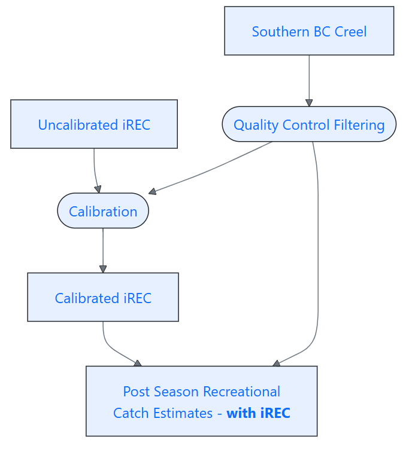
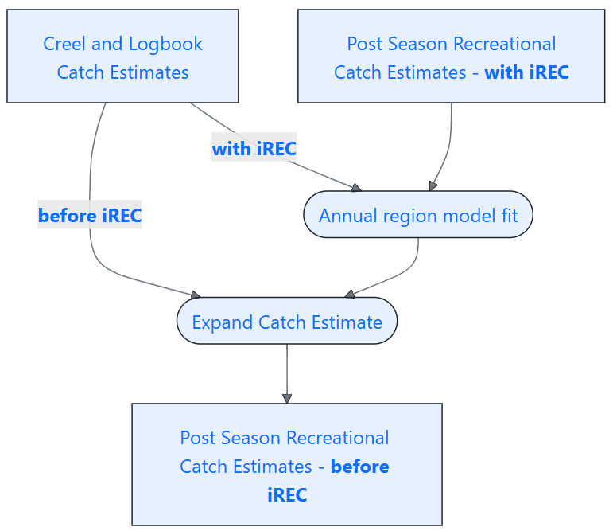

---
output:
  pdf_document: default
  html_document: default
---

# Methods

## Revised Chinook catch estimates with iREC

Since the introduction of iREC in 2012, there have been various methods used to combine Chinook catch information from creel surveys, logbooks, and iREC to produce recreational catch estimates. This has historically resulted in differing recreational catch estimates between domestic reports. The primary purpose of revising recreational catch estimates is to incorporate the different sources of catch into a single standardized set of recreational catch estimates for all Pacific Region marine waters.

### Background on survey methods

We first provide a brief background on the regionally-specific creel and logbook programs, coast-wide iREC reporting, and how each contribute to Chinook catch estimates in a given month and area. More details on each method can be found in relevant technical reports [e.g., @sturhahn2001; @english2002; @korman2005evaluation]. We note any improvements to the data quality assurance and control that occurred in order to create the data sets used in this analysis. While all methods report on multiple species, here we are concerned only with data related to Chinook salmon. The marine areas of interest are all Pacific Fishery Management Areas [PFMAs, Figure \@ref(fig:fig-PFMA), @pfma_2007], as shown and described on the DFO website ^[https://www.pac.dfo-mpo.gc.ca/fm-gp/maps-cartes/areas-secteurs/index-eng.html].A table of how PFMAs map to broader regions and fisheries can be found in Appendix \@ref(apdx-strattab).  

```{r myfigure, echo=FALSE, message=FALSE, warning=FALSE, out.width="70%"}
#| label: fig-PFMA
#| fig-cap: "Pacific Fishery Management Areas"

fig1_path <- "data/pfma-sgpp-eng.png"

knitr::include_graphics(c(fig1_path))

```

#### South Coast Catch Estimation

South Coast catch estimation is a combination of creel surveys and logbooks from both guides and avid angler programs. The South Coast Creel Survey (SCCS), run by DFO, began in the early 1980s and was limited to Strait of Georgia recreational fisheries. It has since expanded in scope to survey PFMAs 10 to 27, including offshore areas (those with PFMA IDs in the 100s). The surveys are generally conducted in the summer months, however some spring and fall surveys occur in specific areas. The survey involves dock-side fisher interviews to capture catch rates and aerial surveys for effort counts. Raw estimates and uncertainty are expanded to cover a given month and area (typically PFMA). Currently, this program estimates the following:

-   Sub-legal sized released catch
-   Legal sized released catch based on adipose-clip status (e.g., clipped/marked and unclipped/unmarked)
-   Legal sized kept catch based on adipose-clip status (e.g., clipped/marked and unclipped/unmarked)

In the past, kept and released catch with unknown adipose clip status were split based on mark rate and release rate of the known catch. For more information and methods about the SCCS, see the most recent program overview and bulletins [e.g. @scab2024]. While the SCCS is the primary source of data for the South Coast, logbook data from guides and avid angler programs are provided on a voluntary basis and are removed from area and month-specific estimates from the creel survey to avoid double-counting.

##### South Coast Creel Survey quality control

Since the SCCSs vary in sampling intensity and spatial-temporal coverage, we have introduced systematic quality control of these estimates. Following the method used for iREC calibration to creel [@irec_sar_2015], we filter the creel estimates based on quality control criteria in a given area and month. These quality control criteria are designed to avoid uncertainty associated with monthly estimate based on only a small number of days or biases when estimates are based on only a certain type of day (e.g., weekends). Each area and monthly creel estimate included in our data was required to meet each of the following criteria:

-   At least three flights for each type of day (weekday or weekend)
-   At least 25 interviews on weekdays OR at least 10% of interviews from weekdays
-   At least 25 interviews on weekends OR at least 10% of interviews from weekends
-   At least a 15 day spread in flights
-   At least a 15 day spread in interviews

These criteria are not applied to areas that have been occasionally surveyed but are not targeted and not estimated by the south coast creel survey (e.g. PFMA 10, 111, 26, and 126). We refer to the creel estimates that pass this quality control as "filtered creel". We use filtered creel both to calibrate iREC and as quality controlled estimates, as described below (section 2.1.4). 

Across all regions, these criteria exclude 49% of all estimates between 2005 and 2026 (Figure \@ref(fig:fig-creel-criteria)). In general, creel survey effort is concentrated around the highest fishing effort in the summer months and in many PFMAs there are no creel surveys during the winter months when there is poor weather and consequently low fishing effort and difficulty in completing aerial surveys. It follows that the summer months of July and August have the highest rate of estimates passing the criteria (> 70% across regions), whereas more than 75% of estimates from the winter months (October through February) fail the criteria. The broadest coverage occurs in the protected waters of the Strait of Georgia, which has a higher population density and can be fished year-round, and the narrowest coverage occurs on the exposed North West Coast of Vancouver Island which is difficult to fish in the winter and therefore has no creel coverage in the winter months. 

There is variability among regions in passing the criteria in the consistently surveyed summer months (July and August). Southern Georgia Strait has the highest proportion of summer estimates failing the criteria (52%), which could be in part due to geography (there are many islands and inlets that make aerial surveys complex) and logistics (high population concentration creates a higher number of launching areas, both private and public, which in turn make capturing an appropriate proportion of fishers in dockside interviews a challenge). In contrast, less populated and more remote parts of Vancouver island have fewer launching areas which make dockside interviews concentrated on the public wharfs and may contribute to the higher quality creel estimates (e.g. 87 and 88% of summer estimates passing in NWCVI and Juan de Fuca respectively). Offshore areas are also geographically simpler for aerial surveys and consequently have some of the highest rates of passing the criteria (e.g. 99% of Area 125). 

Overall, South Coast creel surveys are improving in quality and the rate of passing the criteria has gone from 51% (from 2005-2026) to 71% in the last five years (2021-2026). 

\begin{landscapepage}

```{r methods Loading packages useful functions, message=FALSE, warning=FALSE, results='hide', echo=FALSE}

col1 = "#e0ecf4"
col2 = "#0570b0"
col3 = "lightblue"
col4 = "lightblue4"
col5 = "#fddbc7"
col6 = "#cb181d"
col7 = "#f8f4ff"
col8 = "#86449C"
colclear= "#1C00ff00"

```

```{r methods plotting PFMA creel unfiltered, echo=FALSE, message=FALSE, warning=FALSE, fig.height=20, fig.width=18, fig.align="left", out.width="10in"}
#| label: fig-creel-criteria
#| fig-cap: "South Coast creel estimates that passed (blue) or failed (red) quality control criteria by month and PFMA."

creel_month_PFMA <- pacRecCatch::filter_creel_catch("pacRecCatch_db.yaml")
Creel_month_PFMA_failed <- 
  creel_month_PFMA  |>
  filter(criteria == "failed") |>
  mutate(across(where(is.numeric), ~na_if(., 0))) |>  
  filter(area %notin% c("3", "4", "10", "126", "26", "111"))


Creel_month_PFMA_passed <- 
  creel_month_PFMA |>
  filter(criteria == "passed") |>
  mutate(across(where(is.numeric), ~na_if(., 0)))|>
  filter(area %notin% c("3", "4", "10", "126", "26", "111"))

ggplot() +
  geom_tile(data=Creel_month_PFMA_passed, aes(x=year, y=as.factor(month), fill = estimate),colour = "white") +
  scale_fill_gradient(low = col1, high = col2,  na.value = colclear, limits=c(0,20000)) +
  scale_y_discrete(limits=rev)+
  guides(fill=guide_legend(title="Creel estimates that passed criteria")) +
  new_scale_fill() +
  geom_tile(data=Creel_month_PFMA_failed, aes(x=year, y=as.factor(month), fill = estimate),colour = "white") +
  scale_fill_gradient(low = col5, high = col6,  na.value = colclear, limits=c(0,20000))+
  facet_wrap(~region+area, ncol = 5)+
  guides(fill=guide_legend(title="Creel estimates that failed criteria")) +
  labs(title = "Coverage by PFMA", x = "Year", y = "Month") +
  theme_minimal() + 
  #making the text bigger
  theme(
    legend.position="bottom",
    strip.text = element_text(size = 12), #facet wrap labels
    plot.title = element_text(size = 18, face = "bold"),
    axis.title.x = element_text(size = 14), # x-axis title
    axis.title.y = element_text(size = 17),  # y-axis title
    legend.text = element_text(size = 13),
    axis.text.y = element_text(size = 8),# make y axis bigger,
    plot.margin = margin(2, 2, 2, 2)
  )

# region_summary <- creel_month_PFMA %>%
#   filter(region %notin% c("CBC", "NC")) %>%
#   filter(area %notin% c(10, 126, 26, 111)) %>%
#   group_by(region, criteria) %>%
#   summarise(n = n(), .groups = "drop") %>%
#   group_by(region) %>%
#   mutate(pct = 100 * n / sum(n)) %>%
#   ungroup()
# 
# area_summary <- creel_month_PFMA %>%
#   filter(region %notin% c("CBC", "NC")) %>%
#   filter(area %notin% c(10, 126, 26, 111)) %>%
#   group_by(area, criteria) %>%
#   summarise(n = n(), .groups = "drop") %>%
#   group_by(area) %>%
#   mutate(pct = 100 * n / sum(n)) %>%
#   ungroup()

# all_summary <- creel_month_PFMA %>%
#   filter(region %notin% c("CBC", "NC")) %>%
#   filter(area %notin% c(10, 126, 26, 111)) %>%
#   mutate(region = "All") %>%
#   group_by(region, criteria) %>%
#   summarise(n = n(), .groups = "drop") %>%
#   group_by(region) %>%
#   mutate(pct = 100 * n / sum(n)) %>%
#   ungroup()


```

\end{landscapepage}

#### Central Coast Catch Estimation

Central Coast catch estimation is exclusively logbook data from lodges. The PFMAs included in the Central Coast are 6 through 10, and their offshore counterparts 106 through 110 (Figure \@ref(fig:fig-PFMA)). Catch data is not typically recorded by marked and kept status, so those distinctions are reconstructed using mark rate and release rates estimated by the lodges. The release rates provided have been 0% since 2005, likely an underestimate that iREC can inform. Furthermore, although not all lodges provide logbook catch data, the catch data has historically been reported as the total catch for the region. This was identified as a bias in the recreational catch estimates that iREC inclusion should address.

#### North Coast Catch Estimation

Northern British Columbia (NBC) recreational catch monitoring generally aligns with two distinct regions, Haida Gwaii (i.e. NBC aggregate abundance based management or AABM) and NBC individual stock-based management (ISBM). A combination of independently-run creel programs and logbook data programs are used to monitor each of these regions.

Haida Gwaii covers the marine waters consisting of PFMAs 1, 2 (East and West), 101, 102, and 142. Recreational catch monitoring is carried out using a combination of a creel program run by the Haida Nation and lodge-submitted logbooks. The creel program has operated since 1999 and typically operates from late May to the middle of September. Lodges represent the majority of the catch around Haida Gwaii, particularly around the northern portion in PFMA 1/101. As the logbook program does not capture release data, the creel program data has historically been used to estimate releases from both lodge and non-lodge catch.

The NBC ISBM fishery is monitored by both a Skeena creel program [@robichaud2025creel] and a logbook program run by DFO in PFMAs 3/103 and 4/104. It is unclear how the creel program was operated from 2005 to 2007, however DFO conducted the program from 2008 to 2014 and the North Coast Skeena First Nations Stewardship Society has conducted the program since 2015. Before 2019, the Skeena creel program covered June to August. Since 2019, coverage has been extended to include the May and September long weekends. Creel estimates are corrected for vessels that provide logbook data, allowing the two catch sources to be combined.  For this analysis, we include PFMA 5/105 in NBC ISBM. However, the area is more remote and has limited catch monitoring data. As in the Central Coast, logbook data are not typically collected by marked and kept status so those distinctions need to be reconstructed using mark rates and release rates.

#### Internet Recreational Effort and Catch (iREC) Reporting Program

The Internet Recreational Effort and Catch (iREC) reporting program is used to develop catch estimates for all tidal waters in Canada’s Pacific Region. Recreational fishing in the Pacific Region requires a Tidal Waters Sport Fishing Licence which have been sold predominantly online since roughly 2010. Several types of licences are sold, distinguished by term length, residency, and age. For this program, recreational licence holders are selected to report online, for one assigned month of their licence term, a detailed record of their fishing activity and catch. Reporting is mandatory (but not currently enforced) and for various reasons not all fishers complete the report; completion rates are typically 50-55%. Using the completed reports, estimates of the total kept and released catch, by mark status are developed for each month and PFMA. Uncalibrated estimates are developed by expanding the average monthly catch per licence by the number of licences eligible to fish in that month. These calculations are stratified by licence type to protect against bias due to differential fishing and reporting rates by licence type. Bias correction factors, described in the section below, are then applied to estimate bias-corrected iREC estimates. The iREC program operation and analytical methodology was initially reviewed at a 2015 Canadian Science Advisory Secretariat (CSAS) regional peer review. The main report stemming from that meeting is the associated Science Advisory Report [@irec_sar_2015]. Appendix \@ref(apdx-irec-mthd) details changes to the methodology that have been made since the initial reviewed version, along with some summaries of the realized sample sizes.

#### iREC to Creel Calibration

iREC catch estimates are bias corrected by scaling estimates using the linear regression slope, $m$, between monthly iREC and corresponding creel estimates for angling by boat in each area. Specifically, calibrated iREC point estimates ($iREC^{*}$) of boat-based angling catch are calculated from uncalibrated estimates ($iREC$) as:

$$
m =  \frac{iREC}{creel}
\label{eq:irec_correction}
$$

$$
iREC^{*}= \frac{iREC}{m}
\label{eq:irec_calibration}
$$

The calibration coefficient $m$ is estimated annually for each licence year (i.e. April 1 to March 31) using all area and month estimates of creel that are of appropriate quality based on the criteria identified in the "South Coast Creel Survey quality control" section of this document. Separate calibration factors are estimated for total kept and released catch, by species, for angling by boat. As both the creel and iREC estimates have uncertainty associated with them, an error-in-variables approach is used to estimate $m$ using JAGS (a hierarchical Bayesian analysis program) [@plummer2003jags] through the `rjags` R package [@rjags]. The specific model code used is provided below, with `creel.obs` representing the creel estimate, `creel.se` representing the standard error of the creel estimate, and `iRec.obs` representing the iREC uncalibrated catch estimate for the same area and time as the creel estimate. The calibration coefficient are used to correct both angling by boat and angling from shore catch estimates.  

```{r methods jags, echo=TRUE}
model.jags <- function() {   
  for(i in 1:Ndata) {      
    #generate what true value may be based on se (notice that dnorm in jags      
    # uses 1/variance for second argument thus 1/SE^2)      
    creel.true[i] ~ dnorm(creel.obs[i], 1/creel.se[i]*1/creel.se[i])            
    #now for the actual regression equation     
    mu[i] <- beta1 * creel.true[i]      
    iRec.obs[i] ~ dnorm(mu[i], tau)   
  }      
  beta1 ~ dnorm(0, 0.0001)   
  tau ~ dgram(0.01, 0.01) 
  #a common prior for a variance term in vertical direction     
  #derived variables   
  sigma <- 1/sqrt(tau) 
  #std deviation about the regression line
}
```

### Combining survey methods for best catch estimates

In the past, iREC was incorporated into catch estimates in various ways, including an area-specific infilling method for South Coast areas, and at higher stratification level for the CTC's reporting. Neither of these methods were robust or systematic approaches to incorporating iREC at the finest scale possible. Here, we outline a systematic method for combining survey methods to obtain the best kept and released catch estimates in a given month and PFMA by mark status.

We pulled raw recreational catch data from DFO's Catch and Release Estimates (CREST) database, which stores creel, logbook, and iREC data for both marine and freshwater regions. The data was filtered to only marine estimates of legal-sized fish, by mark status, that were kept or released. Catch estimates for NBC — based on creel and logbook estimates from 2005–2023 — and Central BC (CBC) — based only on logbook estimates from 2022–2023 — were incomplete in CREST for these regions. We filtered CREST catch data to only South Coast creel, as described above, to only include creel estimates with complete and representative coverage. These estimates (which do not include logbook data) were then augmented with logbook data where available (i.e., logbook and creel estimates were summed).

We implemented the methods described in this technical report in a new `pacRecCatch` R package [@pacRecCatch] that pulls data from CREST and loads in other sources manually (e.g. Northern BC creel). The package has functions that subsequently clean, filter, align, and combine the various survey methods to the final data set as described below. This package should provide a framework to implement further improvements to the recreational catch estimation methods in the future.

#### Catch Stratification

Appendix \@ref(apdx-strattab) presents the stratification of fisheries by PFMA and partial PFMAs, organized by monthly ranges used for catch estimation. The CTC Exploitation Rate Analysis (ERA) fisheries are fishery definitions that the CTC reports to estimate stock-specific exploitation rates [@CTC1988]. 

To support consolidated recreational catch estimates and meet Treaty obligations, particularly those involving mark-selective fisheries, Canada recently reorganized the Canadian fishery stratification levels used by the CTC [@CTC2026].  Within the CTC ERA, finescale fisheries are used to define the component fisheries used to represent the final estimated ERA fishery. The newer Canadian finescale fisheries are based on PFMAs and seasons that support the integration of marked and unmarked release rates that spatially represent either all or part of an ERA fishery.

#### Alignment Issues

iREC and creel both generally align spatially to PFMA [@pfma_2007], with some areas split to support unique local conditions. However, there are a few areas that were initially not split within iREC, as is done in creel estimates. Some of the splits, such PFMA 2 and 20 (which are both sometimes split into an east and west portion) are combined for this analysis. PFMA 29 was not split into marine and tidal waters in the earlier years of iREC and the total PFMA 29 catch was treated as all marine catch for this analysis. Later years of iREC provided the marine and tidal separation. In these cases, we limit the analysis to just the marine portion of the PFMA. For PFMA 19 and 23, we combine creel data from 2013 until the split was incorporated into iREC in licence year 2014. Although all these splits are used to improve the quality of estimates from the creel program, the collapsing of these splits are not anticipated to substantially affect the relationship between iREC and creel catch estimates.

### Extrapolating South Coast catch with unknown adipose-clip status

All catch data is typically collected in number of marked and unmarked fish kept and released. However, when mark status is unknown, catch estimates can be provided as kept and released catch with unknown mark status. For North and Central Coast data, we extrapolated these unknown mark status' using provided mark rates from lodges. We extrapolate these unknown mark status estimates to marked and unmarked catch using mark rate of the known catch.

The creel data estimation only started estimating catch by adipose clip status in 2009. Before 2009, most Chinook catch from creel surveys (>70%) was estimated only as total kept and released (i.e. unchecked for mark status). We loaded mark rate data from biosamples collected by creel surveys in South Coast areas from 2005 to 2008 and split both kept and released catch by mark status for each year, month, and area combination. Between 2009 and 2026, mark rate was more consistently reported and only 19% of the creeled catch was unchecked for mark status. For iREC, Between 2013 and 2026, 8% of catch was unchecked for mark status. 

From 2009 to present, we calculated mark rate for a given source in a number of different ways and prioritized the assignment of mark rate to the unchecked catch in the order identified below, based on availability. As mark rate can vary by season and region and is relatively stable year to year, we prioritized mark rates first from within the same area, month, and year and then expanded outward grouping into seasons and regions and finally averaging across years for the very few instances where the other categories did not apply. Toi reduce bias, only mark rates that are based on a total catch estimate $\geq 20$ were used. 

1. Monthly area - Mark rate for unknown catch calculated from known catch within the same year, month, and area. 
2. Monthly regional average -  Mark rate for unknown catch calculated from known catch within the same year, month, and averaged across region. 
3. Seasonal area average - Mark rate for unknown catch calculated from known catch within the same year, area and averaged across season. 
4.  Seasonal regional average - Mark rate for unknown catch calculated from known catch within the same year, averaged across season and region. 
6.  Monthly area average across years - Mark rate for unknown catch calculated from known catch within the same area and month, averaged across years. 
7.  Monthly regional average across years - Mark rate for unknown catch calculated from known catch within the same month, averaged across region and years. 

### Choosing best monthly catch estimate per PFMA

When identifying the best catch estimate between creel (augmented with logbook data) and calibrated iREC, we used different procedures for Southern BC, compared to Northern and Central BC. This allowed catch estimates to align the unique challenges in delivering catch monitoring programs within these various regions.

In Southern BC from 2013 to present, from May to September we use the combined creel and logbook data if the creel passed quality control rules. If the creel failed the quality control in these months, we use calibrated iREC to fill in the gaps. Outside of these months, we use calibrated iREC for October to April. These rules prioritize quality-controlled creel estimates, when most creel survey effort is concentrated, and prioritizes calibrated iREC data during shoulder seasons and anywhere there is a gap in creel coverage. Figure \@ref(fig:fig-area-catch-process) provides a diagram on how the catch data sources are combined.

For Northern and Central BC, we use calibrated iREC from 2015 onwards. Northern and Central BC creel and log book data is not currently incorporated into iREC calibration.  Therefore, calibrated iREC catch estimates provide more consistent and complete coverage across these regions.  This may change with further improvements in iREC calibration and exploring how to incorporate northern creel and log book programs.  Calibrated iREC catch estimates did not seem to be consistent with other catch data sources before 2015. This is potentially related to iREC not achieving effective sample rates in Northern and Central BC.  Therefore, iREC data was limited to estimates after catch year 2015 for those regions.

```{r methods with irec flowchart, out.width="50%", results='asis', echo=FALSE}
#| label: fig-area-catch-process
#| fig-cap: "Diagram showing the steps to identifying the best avaiable catch in Southern BC between creel and iREC from 2013 onward."


```

In Figure \@ref(fig:fig-creel-irec-NGS) we demonstrate how iREC fills in the gaps in each PFMA using the Northern Strait of Georgia finescale fishery as an example.


\begin{landscapepage}

```{r methods pfma_month again, message=FALSE, warning=FALSE, results='hide', echo=FALSE}

pfma_yearMonth <- 
  sport_catch_area |>
  group_by(year, month, area, region, finescale_fishery) |>
  summarise(sum_creel = sum(creel, na.rm = TRUE), 
            sum = sum(creel_plus, na.rm = TRUE), 
            sum_historic = sum(historic_plus, na.rm = TRUE), 
            sum_catch_estimate = sum(catch_estimate, na.rm = TRUE), 
            sum_irec = sum(irec_calibrated, na.rm = TRUE),
            .groups = "drop") |>
  mutate(across(where(is.double), ~na_if(., 0)))

pfma_yearMonth_catch_estimate_1 <- 
  pfma_yearMonth  |>
  filter(sum_catch_estimate != sum, 
         sum_catch_estimate != sum_historic, 
         sum_catch_estimate != sum_irec)

pfma_yearMonth_irec_1 <-
  pfma_yearMonth |> 
  filter(sum_catch_estimate == sum_irec)
```


```{r echo=FALSE, fig.align="left", fig.height=8, fig.width=8, message=FALSE, warning=FALSE, out.width="8in"}
#| label: fig-creel-irec-NGS
#| fig-cap: Catch estimates in Northern Strait of Georgia by area and month and chosen best catch estimate between creel and iREC

ngs_catch <-
  pfma_yearMonth |>
  filter(region == "NGS", year >= 2013) |>
  mutate(finescale_fishery = factor(finescale_fishery, 
                                    levels = c("NGS S SPRING", "NGS S SUMMER", "NGS S FALL")))

ngs_irec_catch <-
  pfma_yearMonth_irec_1|>
  filter(region == "NGS", year >= 2013) |>
  mutate(finescale_fishery = factor(finescale_fishery, 
                                    levels = c("NGS S SPRING", "NGS S SUMMER", "NGS S FALL")))

g <-
  ggplot()+
  geom_tile(data = ngs_catch, 
            aes(x=year, y=as.factor(month), fill = sum_catch_estimate), 
            colour = "white") +
  scale_fill_gradient(low = col1, high = col2,  na.value = colclear, limits=c(0,20000)) +
  scale_y_discrete(limits = rev)+
  guides(fill=guide_legend(title="Filtered creel + logbook estimate")) +
  new_scale_fill() +
  geom_tile(data = ngs_irec_catch, 
            aes(x=year, y=as.factor(month), fill = sum_catch_estimate), 
            colour = "white") +
  scale_fill_gradient(low = col7, high = col8,  na.value = colclear, limits=c(0,15000))+
  #facet_wrap(~finescale_fishery_old+AREA, nrow=1)+
  facet_grid(finescale_fishery ~ area, scales = "free_y", space = "free_y") +
  guides(fill=guide_legend(title="calibrated iREC")) +
  labs(title = paste0("Coverage by PFMA for Northern Strait of Georgia"),
       x = "Year", y = "Month") +
  theme_bw() + theme_minimal() + geom_vline(xintercept = 2013)+
  theme(legend.position="bottom",
        legend.box = "vertical",
        legend.box.just = "left") 
g
```

\end{landscapepage}

## Revised Chinook catch estimates before iREC

Where iREC is unavailable (before 2013 in Southern BC and before 2015 in North/Central BC), we predict iREC-incorporated catch estimates by finescale fishery using a modeled relationship between summertime creel estimates without iREC and seasonal iREC-incorporated catch estimates from the associated years of creel data. These seasonal estimates are then rolled up into yearly estimates. We selected 2005 as the starting point for the time series as it is the first year that fish from brood year 2003 are caught in pre-terminal sport fisheries (as age 2s), and 2003 is the earliest brood that could contribute to the the 2009 CYER (as age 6s). This process, shown in Figure \@ref(fig:fig-before-irec-flowchart) below, is automated and accomplished in the modelling function of the `pacRecCatch` R package [@pacRecCatch].

```{r methods before irec flowchart, out.width="65%", results='asis', echo=FALSE}
#| label: fig-before-irec-flowchart
#| fig-cap: "Diagram showing the steps to identifying expanded catch within all regions in years before iREC is available."


```

### Splitting fisheries by season

Following the rules for incorporating iREC into the best catch estimate, we split previous fisheries into spring (months 1:4), summer (months 5:9), and fall (10:12) seasons. Fisheries were split by season in order to better combine estimates since there are not always iREC or creel estimates for each month. We did not split terminal fisheries up by season as they typically are defined by limited time periods for a given stock. Seasonality is also an important consideration for calculating marked released and unmarked kept rates used to evaluate mark-selective fishing (see below for more detail). 

With many of the fisheries, there is a relatively consistent partial creel and logbook coverage in the summer throughout the time series (from 2005 to 2023). This consistent period of coverage is used to predict the estimated catch in the other years where we don't have iREC. For South Coast fisheries, this data is unfiltered South Coast creel + logbook catch estimates; for North and Central coast this data is referred to as "historical" but is logbook only for Central Coast and a combination of unfiltered Haida or Area 3/4 creel and logbook catch estimates in the North.

### Modelling protocol

For this initial effort to provide a consistent time series back to 2005, we explored several different model forms to develop a relationship between the creel + logbook data and the total catch estimates. Although we describe some of other relationships that were explored in the course of developing the models, we do not describe all the model forms explored and focus on the final selected model. We did not consider random effects models since there were not enough levels of each factor to warrant random effects inclusion (typically \>10). We incorporated an automated model selection process that explored various model forms and distribution families. Several key criteria that were used when developing the model relationships include:

 * Separate models for southern vs. central and northern BC fisheries, as the data inputs are different
 * Annual models for central and northern fisheries, since catch data are sparse outside of the summer months
 * Separate models for spring and fall fisheries vs. their summer counterparts, since these are iREC-only data
 * Explored grouping fisheries within larger regions vs. separating by finescale fishery
 * All models based on the four categories of catch (marked kept, marked released, unmarked kept, and unmarked released) in the same model in order to have a single underlying model for each total catch estimate

The automated model selection followed this protocol: 
 * We first generated a data set tested for each global model that contained no missing values so models could be compared 
 * We then fit to the cleaned data set a global model with the maximum number of relevant terms (typically included unfiltered creel, region or finescale fishery, mark_status (marked vs. unmarked), kept_status (kept vs. released), management(aabm vs. isbm), and their interactions)
 * Then we used the dredge function in `MuMIn` package [@mumin] to generate a model selection table of all subsets of the global model, with two variations: a gaussian distribution with an identity link and a Gamma distribution with a log link. These distributions are all consistent with our positive, continuous data.
 * Next, we filtered the table to exclude complex models nested within simpler models with a lower AIC [@Richards2008]
 * We filtered the table by delta AIC < 2 [@BurnhamandAnderson2003] to get the set of models with the most support
 * Then, we chose the simplest model (least # of terms) as the final model, following the principle of parsimony
 
This protocol generated a candidate model for each seasonal and regional grouping tested. Since models with different subsets of data (e.g. all south coast creel grouped vs. separated by finescale fishery) can not be compared with AIC, we ranked models on visual diagnostics and pseudo-R^2 (a goodness of fit test, [@Nakagawa2017]). For all candidate models we used the `DHARMa` package [@dharma] to create a qq-plot to detect deviations in observations from expected distribution and a plot of the residuals against predicted values to detect patterns in residuals. We visually assessed whether candidate models improved plots and looked at tests for deviations between observed and simulated dispersion, outliers, and uniformity. Finally, an effort was made to use a gaussian fit unless a Gamma fit was substantially better. This mitigates potential large increases or decreases in predicted catch when creel catch estimates are outside the range of estimates observed with the fitted data. Taking these factors into account, we selected the model with the best visual diagnostics and fit.


### Model validation with Salmon Head Recovery Program

We validated the marked kept catch estimates from our top candidate models by regressing both the predominantly observed catch (with iREC; 2013-2023) and the modelled catch (2005-2012) with the number of marked Chinook heads by the Salmon Head  Recovery Program (SHRP), which collects heads from recreational fisheries to recover CWTs. The slope of the linear regression between the kept marked catch and the number of heads across CWT regions and seasons should provide the average submission rate of all recreational fisheries. Since there were no substantial changes to how the SHRP is delivered over both the modeled and observed catch time periods, the slopes should be similar, with any deviations potentially indicating a lack in congruence between the two catch time series.

## Incorporation of both sets of revised estimates in bilateral PST processes 

The Chinook Technical Committee (CTC) produces several annual analyses and reports for the Pacific Salmon Commission (PSC). Notably: (1) the Catch and Escapement Report which details catch and escapement across all fisheries [e.g., @CTC2025b]; (2) the Exploitation Rate Analysis (ERA) report that uses a cohort analysis on CWT hatchery stocks to calculate Calendar Year Exploitation Rates on a stock-specific basis [e.g., @CTC2025]; and, (3) the Calibration Report, which documents the annual PSC Chinook model calibration that utilizes data from the ERA and other sources to forecast ocean abundances [e.g., @CTC2024]. 

Since 2025, both sets of revised catch estimates (modeled from 2005-2012 and augmented from 2013-2023) have been incorporated into the analyses and subsequent results presented within these annual reports. Notably, in the Annual Catch and Escapement Report, the total number of kept and released Chinook has been updated with the revised catch. Catch estimates are used as inputs to the annual ERA in two places: (1) kept and marked catch estimates are used to expand CWT observations from the SHRP to CWT estimates uploaded to the Regional Mark Information System (RMIS[^3]) and subsequently used in backward cohort analyses within the ERA; and (2) kept and released catch estimates by mark status from most sport fisheries are incorporated into the Chinook non-retention process within the ERA. 

An initial update to catch estimates based on the methods defined in this technical report was incorporated into the 2025 ERA in order to support the transition to analyzing mark selective fisheries within the CTC. Subsequent to that update, corrections and improvements have been made to the methods and iREC data. A table comparing the creel + log book catch, the catch estimates incorporated into the February 2025 ERA and the final estimates using the updated methods within this report is provided for kept (Table \@ref(tab:tbl-previous-kept-catch)) and released (Table \@ref(tab:tbl-previous-released-catch)) catch.

[^3]: <https://www.rmpc.org/>

### Updating CWT estimates

Recreational fishery CWT sampling in BC collects marked Chinook and Coho heads from recreational fishers. These heads are obtained through numerous sources, including: general public submitting heads to SHRP depots^[https://search.open.canada.ca/openmap/3cc03bbf-d59f-4812-996e-ddc52e0ba99e] (distributed coastwide at landing sites, marinas, and tackle shops), collected through creel surveyor interviews, and bio-sampling provided by avid anglers, guides, and lodges.

In order to expand CWT observations to a total "estimated number", an estimated sample rate (i.e., submission rate) is required; sample rate is estimated as the total heads submitted in a spatio-temporal stratum divided by the estimated marked kept catch in that stratum. These sample rates are corrected for lost tags that may occur during sample processing, based on the assumption that other CWT observations in the sample represent the lost CWT.

Historically, there have been numerous gaps and higher uncertainty in recreational catch estimates from periods and regions where fishing effort is typically lower, due to either a complete lack of marked catch estimates or from inconsistencies between recoveries and estimated marked catch (e.g., more samples than marked catches). In such cases, several methods have been used to estimate submission rates. The most common approach has been to apply the average submission rate from other regions and time periods with more complete creel survey-based catch estimates to these data-deficient periods and areas (e.g., Southern BC submission rates may be used to estimate recoveries in Central BC or summer submission rates are used to estimate winter recoveries). In other cases, the assumed maximum or minimum submission rates were applied when estimated rates were extreme and presumed to result from uncertainty in marked kept catch estimates. The implementation of iREC provides complete representation of recreational catch in the Pacific Region [@irec_sar_2015]. Using these iREC estimates, in combination with ongoing creel-based estimates from periods and areas with high fishing effort now allows us to directly estimate submission rates for most spatio-temporal strata. As discussed in @CYER2021, such a transition from indirect to direct estimation of submission rates will improve the accuracy of the resulting estimates.

Submission rates for recreational catch may vary both spatially and temporally for other various reasons (e.g., the proportion of guided catch, the presence of creel surveyors, availability of head depots in an area, fisher awareness, and support of the program). To help mitigate this variability, BC marine waters are split into smaller regions that better represent different recreational fisher communities. To better align the CWT estimates with updated recreational catch estimates, Chinook CWT regions were redefined for 2005 through to the present (as shown in Figure \@ref(fig:fig-CwtMap)).

```{r cwtmap, echo=FALSE, message=FALSE, warning=FALSE, fig.height = 8}
#| label: fig-CwtMap
#| fig-cap: "New spatial regions used to estimate CWT recoveries."

bc_polygon <- read_sf("data/map/bc_polygon_simple.shp")
cwt_region <- read_sf("data/map/CWT_Region_simple.shp")
us_polygon <- read_sf("data/map/US_Polygon_5.shp")

#select only geometry column from both us and bc map
bc_polygon_geo <- bc_polygon %>%
  select(geometry)

us_polygon_geo <- us_polygon %>%
  select(geometry)

#transformiong us map to match up crs with canada map
us_polygon_geo <- st_transform(us_polygon_geo, st_crs(bc_polygon_geo))


combined_map <- rbind(bc_polygon_geo, us_polygon_geo)

#crop the map so it shows the bc coast
whole_coast_cropped <- st_crop(combined_map, 
                               xmin = -990416 , 
                               xmax = 1400416 ,
                               ymin = 299418, 
                               ymax = 1149418 )

#set pallete
num_regions <- length(unique(cwt_region$cwt_region))
palette <- RColorBrewer::brewer.pal(n = num_regions, name = "Set3")

cwt_region_centroids <- cwt_region %>%
  mutate(label_x = st_coordinates(st_centroid(geometry))[, 1],
         label_y = st_coordinates(st_centroid(geometry))[, 2]) %>%
  #move the label down and right a bit
  mutate(label_y_adjusted = label_y - 40000,
         label_x_adjusted = label_x + 40000)

#make the map
whole_bc_map_gg <- ggplot() +
  geom_sf(data = whole_coast_cropped, fill = "lightgreen", color = "black") +
  # Adjust borders of the land masses
  geom_sf(data = cwt_region, aes(fill = cwt_region), color = "black", size = 0.5) +
  # Set the color palette for cwt_region
  scale_fill_manual(values = palette, na.value = "white") +
  # Add labels
  geom_label(data = cwt_region_centroids, 
             aes(x = label_x_adjusted, 
                 y = label_y_adjusted, 
                 label = cwt_region),
             size = 3,
             fill = "white", 
             color = "black", 
             label.size = 0,  # No border around label
             check_overlap = TRUE) +
  # Add a theme
  theme_void() +
  theme(legend.position = "none",
        plot.margin = margin(0, 0, 0, 0)) 

whole_bc_map_gg

```

In addition to redefining the spatial regions of CWT estimates, the temporal periods for submission rates and resulting CWT estimates were adjusted to align with the seasonal periods applied to the updated catch estimates: Spring (January to April), Summer (May to September), Fall (October to December). The exception is for northern regions (e.g., Central BC and Northern BC) where annual submission rates are used, as spring and fall fisheries are too small to estimate total CWT recoveries separately.

#### Changes to Indirect CWT Estimation Methods

Despite improvements in CWT recovery strata and the associated complete spatio-temporal coverage in recreational catch, in rare cases for certain strata, the combination of the marked catch estimate and head submissions may still lead to substantial submission rate outliers. Approximately 2.5% of all observed CWT recoveries are associated with regions and time periods with an estimated marked catch of zero or result in extreme submission rates (i.e., less than 2% or greater than 40%), mostly in years prior to iREC (pre-2013) where we rely only on modeled catch. 

For cases where these outliers may result from uncertainty in the marked catch estimate rather than sudden substantial changes to the SHRP submission rate, we developed indirect methods of estimating submission rates via standardized methods that leverage the more extensive coverage of recreational catch estimates. Two different methods were used based on the nature of the data deficiency and the CWT strata for which the method is applied.

**Method 1:** When a time period (i.e., season) within a region has an outlier submission rate ($s$), the first option is to use an annual average of all the time periods ($i$) within the region weighted by the number of heads ($h$) in each period using the equation below (Equation \eqref{eq:cwt_wght_avg}). This should weight the annual average submission rate ($\bar{s}$) used for the outlier period to a rate that has the lowest uncertainty, based on the assumption that periods with the lowest uncertainty will have the highest number of heads contributed to the program.

$$
\bar{s} = \frac{\sum_i h_i s_i}{\sum_i h_i}
\label{eq:cwt_wght_avg}
$$

**Method 2:** In some circumstances, the average annual submission rate derived from Method 1 may still produce an outlier. This typically occurs in the Strait of Georgia prior to iREC reporting. In these circumstances, a weighted average of the annual submission rates 2 years prior and 2 years after the year of the outlier are used. This moving average should better represent average submission rate of fishers in the region for that season, as the knowledge and implementation of the SHRP are not expected to vary substantially across years within a region (e.g., head depot operations are generally consistent).

### Updating Chinook non-retention (release) estimates

In 2025, in an attempt to account for mark-selective fisheries, the CTC switched the ERA from a model that only accounts for Chinook non-retention without mark-selectively, to a model that supports mark-selective fisheries [@CTC2025]. Therefore, the ERA requires the marked release rate ($MRR$) and unmarked kept rate ($UKR$) [details provided in @CYER2024] by finescale fishery in conjunction with the revised catch estimates. In a given CTC finescale fishery, $MRR$ and $UKR$ are calculated based on the catch, $C$, using the following:

$$
MRR = C_{marked, released} / (C_{marked, released} + C_{marked, kept})
\label{eq:mrr}
$$

$$
UKR = C_{unmarked, kept} / (C_{unmarked, released} + C_{unmarked, kept})
\label{eq:ukr}
$$

We calculated the $MRR$ and $UKR$ at an area and month scale and then use a weighted average based on total catch per area and month to estimate a finescale fishery-specific $MRR$ and $UKR$. Within the ERA, these finescale fishery $MRR$ and $UKR$ values are incorporated into a ERA fishery value based on a cohort-specific weighted average of each finescale value.

With the exception of Juan de Fuca, which did have mark-selective fisheries before 2013, all other sport fisheries were non-selective before 2013. Since the data is modeled, we did not want to bias the previous non-selective fisheries by allowing for selectivity, therefore we have fixed the $MRR$ and $UKR$ rates to be equivalent in the modeled data, by calculating a single release rate for marked and unmarked fish combined based on the following equation:

$$
MRR = 1 - UKR
\label{eq:none_selective_mrr}
$$

After 2013, the data is observed and therefore allowed to vary in mark-selectivity even if no specific mark-selective regulations were imposed. Terminal fisheries typically happen in the summer period, therefore they were assigned the same $MRR$ and $UKR$ rates as the equivalent summer fishery.
