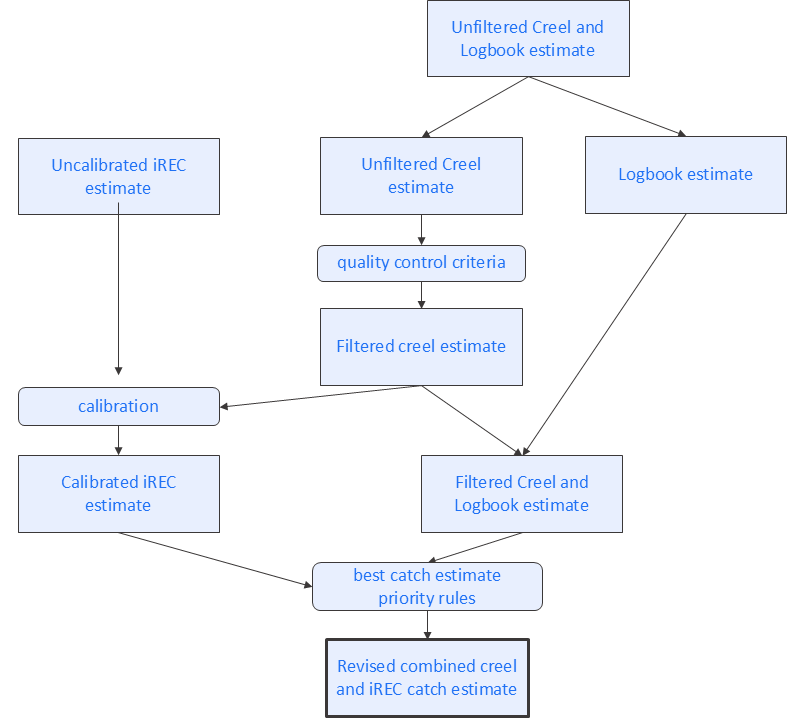
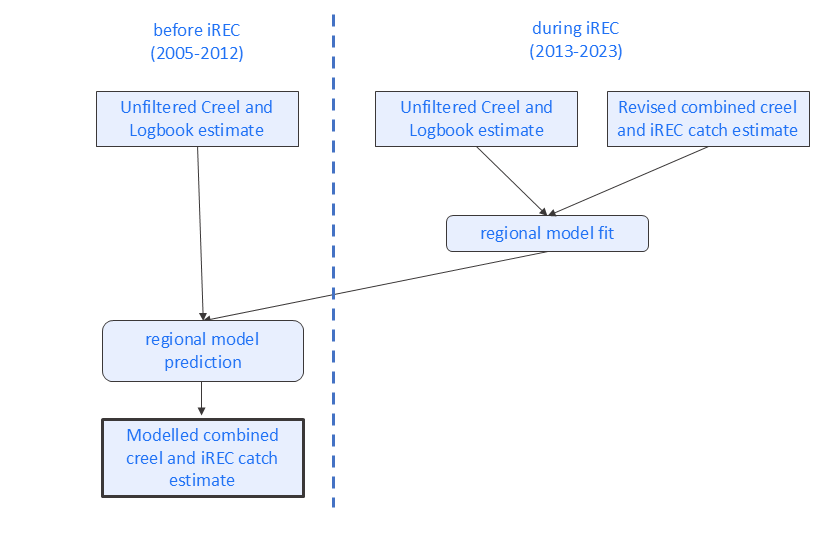

---
output:
  pdf_document: default
  html_document: default
---
\clearpage
# Methods {#sec:methods}
## Revised Chinook catch estimates with iREC
Since the introduction of iREC in 2012, there have been various methods
used to combine Chinook catch information from creel surveys, logbooks,
and iREC to produce recreational catch estimates. This has historically
resulted in differing recreational catch estimates between domestic
reports. The primary purpose of revising recreational catch estimates is
to incorporate the different sources of catch into a single standardized
set of recreational catch estimates for all Pacific Region marine
waters.

We first provide a brief background on the region-specific creel and
logbook programs, coast-wide iREC reporting, and how each contribute to
the best Chinook catch estimates in a given month and area. More details on each
method can be found in relevant technical reports [e.g., @sturhahn2001;
@english2002; @korman2005evaluation]. We note any improvements to the
data quality assurance and control that occurred in order to create the
data sets used in this analysis. While all methods report on multiple
species, here we are concerned only with data related to Chinook salmon.
The marine areas of interest are all Pacific Fishery Management Areas
[PFMAs, Figure \@ref(fig:fig-PFMA), @pfma_2007], as shown and described
on the DFO website [^1]. A table of how PFMAs map to broader regions and
fisheries can be found in Appendix \@ref(apdx-strattab).

### Background on survey methods
#### South Coast Catch Estimation
South Coast catch estimation is a combination of creel surveys and
logbooks from both guides and avid angler programs. The South Coast
Creel Survey (SCCS), run by DFO, began in the early 1980s and was
limited to Strait of Georgia recreational fisheries. It has since
expanded in scope to survey PFMAs 10 to 27, including offshore areas
(those with PFMA IDs in the 100s). The surveys are generally conducted
in the summer months, however some spring and fall surveys occur in
specific areas. The survey involves dock-side fisher interviews to
record catch rates and aerial surveys for effort counts. Raw estimates
and uncertainty are expanded to cover a given month and area (typically
PFMA). Currently, this program estimates the following:

- Sub-legal sized released catch
- Legal sized released catch based on adipose-clip status (e.g.,
  clipped/marked and unclipped/unmarked)
- Legal sized kept catch based on adipose-clip status (e.g.,
  clipped/marked and unclipped/unmarked)

[^1]: <https://www.pac.dfo-mpo.gc.ca/fm-gp/maps-cartes/areas-secteurs/index-eng.html>

```{r myfigure, echo=FALSE, message=FALSE, warning=FALSE, out.width="100%"}
#| label: fig-PFMA
#| fig-cap: "Pacific Fishery Management Areas"

fig1_path <- "data/pfma-sgpp-eng.png"

knitr::include_graphics(c(fig1_path))

```

In the past, kept and released catch with unknown adipose clip status
were split based on mark rate and release rate of the known catch. For
more information and methods about the SCCS, see the most recent program
overview and bulletins [@scab2024; @Ma2026]. While the SCCS is the primary
data source for the South Coast, logbook data from guides and avid
angler programs are provided on a voluntary basis and are removed from
area and month-specific estimates from the creel survey to avoid
double-counting.

##### South Coast Creel Survey quality control {#qc}
```{r methods functions, message=FALSE, warning=FALSE, results='hide', echo=FALSE}

col_blue_light = "#def3ff"
col_blue = "#0072B2"
col_lightblue = "#56B4E9"
col4 = "lightblue4"
col_orange_light = "#ffd6b5"
col_orange = "#D55E00"
col_purple_light = "#faf2f6"
col_purple = "#CC79A7"
colclear= "#1C00ff00"
col_green_light = "#00dea1"
col_green = "#009E73"
col_green_dark = "#005e45"
col_yellow_light = "#ffe9b9"
col_yellow = "#E69F00"
col_red = "#950606"
col_red_light = "#fcaaaa"
col_black = "#000000"
col_black_light = "#cfcfcf"
col_grey = "#536878"
col_grey_light = "#dde3e7"

fmt_stat <- function(x, digits = 3, scale = 1) {
  x <- suppressWarnings(as.numeric(x))
  if (is.na(x)) return("--")
  format(x * scale, digits = digits, big.mark = ",")
}


region_order<-c("NWCVI", "SWCVI", "NGS", "SGS", "JNST", "JDF", "NBC AABM","NBC ISBM", "CBC")

Creel_month_PFMA_failed <- 
  creel_month_PFMA  |>
  filter(criteria == "failed", year<2026) |>
  mutate(across(where(is.numeric), ~na_if(., 0))) |>  
  filter(area %notin% c("3", "4", "10", "126", "26"))|>
  mutate(region = factor(region, levels = region_order))


Creel_month_PFMA_passed <- 
  creel_month_PFMA |>
  filter(criteria == "passed", year<2026) |>
  mutate(across(where(is.numeric), ~na_if(., 0)))|>
  filter(area %notin% c("3", "4", "10", "126", "26"))|>
  mutate(region = factor(region, levels = region_order))

region_summer <- creel_month_PFMA %>%
  filter(region %notin% c("CBC", "NC")) %>%
  filter(month %in% c(7,8)) %>%
  filter(area %notin% c(10, 126, 26, 111)) %>%
  group_by(region, criteria) %>%
  summarise(n = n(), .groups = "drop") %>%
  group_by(region) %>%
  mutate(pct = 100 * n / sum(n)) %>%
  ungroup()


area_summer <- creel_month_PFMA %>%
  filter(region %notin% c("CBC", "NC")) %>%
  filter(area %notin% c(10, 126, 26, 111)) %>%
  filter(month %in% c(7,8)) %>%
  group_by(area, criteria) %>%
  summarise(n = n(), .groups = "drop") %>%
  group_by(area) %>%
  mutate(pct = 100 * n / sum(n)) %>%
  ungroup()

all_summary <- creel_month_PFMA %>%
  filter(region %notin% c("CBC", "NC")) %>%
  filter(area %notin% c(10, 126, 26, 111)) %>%
  mutate(region = "All") %>%
  group_by(region, criteria) %>%
  summarise(n = n(), .groups = "drop") %>%
  group_by(region) %>%
  mutate(pct = 100 * n / sum(n)) %>%
  ungroup()

all_summary_2005_2020 <- creel_month_PFMA %>%
  filter(region %notin% c("CBC", "NC")) %>%
  filter(area %notin% c(10, 126, 26, 111)) %>%
  filter(year < 2021) %>%
  mutate(region = "All") %>%
  group_by(region, criteria) %>%
  summarise(n = n(), .groups = "drop") %>%
  group_by(region) %>%
  mutate(pct = 100 * n / sum(n)) %>%
  ungroup()

all_summary_2005_2020b <- creel_month_PFMA %>%
  filter(region %notin% c("CBC", "NC")) %>%
  filter(area %notin% c(10, 126, 26, 111)) %>%
  filter(year < 2021) %>%
  group_by(region, criteria) %>%
  summarise(n = n(), .groups = "drop") %>%
  group_by(region) %>%
  mutate(pct = 100 * n / sum(n)) %>%
  ungroup()

all_summary_2021_2025 <- creel_month_PFMA %>%
  filter(region %notin% c("CBC", "NC")) %>%
  filter(area %notin% c(10, 126, 26, 111)) %>%
  filter(year > 2020) %>%
  mutate(region = "All") %>%
  group_by(region, criteria) %>%
  summarise(n = n(), .groups = "drop") %>%
  group_by(region) %>%
  mutate(pct = 100 * n / sum(n)) %>%
  ungroup()


all_summary_2021_2025b <- creel_month_PFMA %>%
  filter(region %notin% c("CBC", "NC")) %>%
  filter(area %notin% c(10, 126, 26, 111)) %>%
  filter(year > 2020) %>%
  group_by(region, criteria) %>%
  summarise(n = n(), .groups = "drop") %>%
  group_by(region) %>%
  mutate(pct = 100 * n / sum(n)) %>%
  ungroup()


```

Since the SCCSs vary in sampling intensity and spatial-temporal
coverage, we have introduced systematic quality control of these
estimates. Following the method used for iREC calibration to creel
[@irec_sar_2015], we filter the creel estimates based on quality control
criteria in a given area and month. These quality control criteria are
designed to avoid uncertainty associated with monthly estimates based on
only a small number of days or biases when estimates are based on only a
certain type of day (e.g., weekends). Each area and monthly creel
estimate included in our filtered data set met each of the following
criteria:

- At least three flights for each type of day (weekday or weekend)
- At least 25 interviews on weekdays OR at least 10% of interviews from
  weekdays
- At least 25 interviews on weekends OR at least 10% of interviews from
  weekends
- At least a 15 day spread in flights
- At least a 15 day spread in interviews

These criteria are not applied to areas that have been occasionally
surveyed but are not targeted and not estimated by the South Coast creel
survey throughout the whole time series (e.g., PFMA 26, and 126), or are in other regions (e.g., PFMA 10 in CBC, 3 and 4 in NBC). We refer to the creel estimates that pass this quality control as "filtered creel". We use these filtered creel
both to calibrate iREC (section \@ref(calib)) and as quality controlled estimates (section \@ref(best)), as described below.

Across all regions, these criteria exclude `r fmt_stat(all_summary$pct[all_summary$criteria == "failed"])`% of all estimates between
2005 and 2025 (Figure \@ref(fig:fig-creel-criteria)). In general, creel
survey effort is concentrated around the highest fishing effort in the
summer months and in many PFMAs there are no creel surveys during the
winter months when there is poor weather and consequently low fishing
effort and difficulty in completing aerial surveys. It follows that the
summer months of July and August have the highest rate of estimates
passing the criteria (\> 70% across regions), whereas more than 75% of
estimates from the winter months (October through February) fail the
criteria. The broadest coverage occurs in the protected waters of the
Strait of Georgia, which has a higher human population density and can
be fished year-round, and the narrowest coverage occurs on the exposed
North West Coast of Vancouver Island (NWCVI) which is difficult to fish in the
winter and therefore has no creel coverage in the winter months.

\newpage

\begin{landscapepage}
```{r methods plotting PFMA creel unfiltered, echo=FALSE, message=FALSE, warning=FALSE, fig.height=12, fig.width=20,  out.width="110%", fig.asp=NA, fig.align='left'}
#| label: fig-creel-criteria
#| fig-cap: "South Coast creel estimates that passed (yellow) or failed (red) quality control criteria by month and PFMA."

ggplot() +
  geom_tile(data=Creel_month_PFMA_passed, aes(x=year, y=as.factor(month), fill = estimate),colour = "white") +
  scale_fill_gradient(low = col_yellow_light, high = col_yellow,  na.value = colclear, limits=c(0,20000)) +
  scale_y_discrete(limits=rev)+
  guides(fill=guide_legend(title="Creel estimates that passed criteria")) +
  new_scale_fill() +
  geom_tile(data=Creel_month_PFMA_failed, aes(x=year, y=as.factor(month), fill = estimate),colour = "white") +
  scale_fill_gradient(low = col_red_light, high = col_red,  na.value = colclear, limits=c(0,20000))+
  facet_wrap(~region+area, ncol = 7)+
  guides(fill=guide_legend(title="Creel estimates that failed criteria")) +
  labs(x = "Year", y = "Month") +
  theme_minimal() + 
  #making the text bigger
  theme(
    legend.position="bottom",
#     legend.box = "vertical",
    strip.text = element_text(size = 12), #facet wrap labels
    plot.title = element_text(size = 18, face = "bold"),
    axis.title.x = element_text(size = 14), # x-axis title
    axis.title.y = element_text(size = 17),  # y-axis title
    legend.text = element_text(size = 13),
    axis.text.y = element_text(size = 8),# make y axis bigger,
    plot.margin = margin(2, 2, 2, 2)
  )

```
\end{landscapepage}
\clearpage

The proportion of estimates that pass all criteria in the consistently surveyed summer months (July and August) vary among regions. Southern Strait
of Georgia has the highest proportion of summer estimates that fail the
criteria (`r fmt_stat(region_summer$pct[region_summer$region == "SGS" & region_summer$criteria == "failed"])`%), which could be in part due to geography (there are many
islands and inlets that make aerial surveys complex) and logistics (high
population concentration creates a higher number of launching areas,
both private and public, which in turn make capturing an appropriate
proportion of fishers in dockside interviews a challenge). In contrast,
less populated and remote parts of Vancouver Island have fewer
launching areas, concentrating dockside interviews on
public wharfs and may contribute to the higher quality creel estimates
(e.g., `r fmt_stat(region_summer$pct[region_summer$region == "NWCVI" & region_summer$criteria == "passed"])` and `r fmt_stat(region_summer$pct[region_summer$region == "JDF" & region_summer$criteria == "passed"])`% of summer estimates passing in NWCVI and Juan de Fuca,
respectively). Offshore areas are also geographically simpler for aerial
surveys and consequently have some of the highest rates of estimates passing the
criteria (e.g., `r fmt_stat(area_summer$pct[area_summer$area == "125" & area_summer$criteria == "passed"])`% of Area 125).

Overall, South Coast creel surveys are improving in quality and the rate
of estimates passing the criteria has gone from `r fmt_stat(all_summary_2005_2020$pct[all_summary_2005_2020$criteria == "passed"])`% (from 2005-2020) to `r fmt_stat(all_summary_2021_2025$pct[all_summary_2021_2025$criteria == "passed"])`% in the last five years (2021-2025).

#### Central BC Catch Estimation
Central BC catch estimation relies exclusively on logbook data from lodges.
The PFMAs included in the Central BC are 6 through 10, and their
offshore counterparts 106 through 110 (Figure \@ref(fig:fig-PFMA)).
Catch data is not typically recorded by marked and kept status, so those
distinctions are reconstructed using mark rate and release rates
estimated by the lodges. The release rates provided have been 0% since
2005, likely an inaccuracy that could be informed by iREC. Although not all lodges provide logbook catch data, the catch data has historically been reported as the total catch for the region. This was
identified as a bias in the recreational catch estimates that iREC
inclusion should address. 

#### Northern BC Catch Estimation
Northern British Columbia (NBC) recreational catch monitoring generally
aligns with two distinct regions, Haida Gwaii (i.e., NBC aggregate
abundance based management or AABM) and NBC ISBM. A combination of independently-run creel programs and
logbook data programs are used to monitor each of these regions.

Haida Gwaii covers the marine waters consisting of PFMAs 1, 2 (East and
West), 101, 102, and 142. Recreational catch monitoring is carried out
using a combination of a creel program run by the Haida Nation and
lodge-submitted logbooks. The creel program has operated since 1995,
typically from late May to the middle of September [@Searing2000]. One difference from the South Coast creel program is that some boat effort counts are conducted by boat instead of aerial survey. Lodges
represent the majority of the catch around Haida Gwaii, particularly
around the northern portion in PFMA 1/101. As the logbook program does
not capture release data, the creel program data has historically been
used to estimate releases from both lodge and non-lodge catch.

The NBC ISBM fishery is monitored by both a creel program
[@robichaud2025creel] and a logbook program in PFMAs 3/103
and 4/104. The creel program has been operated first by DFO starting in 1995, it was not operated in 2005 or 2007 [@VanTongeren2010], however it ran each year from 2008 to 2014 and the North Coast Skeena First Nations Stewardship Society has conducted the program since 2015. Before 2019, the Skeena creel program covered June to August. Since 2019, coverage has been extended to include the May and
September long weekends. Creel estimates are corrected for vessels that
provide logbook data, allowing the two catch sources to be combined. For this analysis, we include PFMA 5/105 in NBC ISBM. However, the area is
more remote and has limited catch monitoring data. As in the Central
Coast, logbook data are not typically collected by marked and kept
status so those distinctions need to be reconstructed using mark
and release rates.

#### iREC Reporting Program
The Internet Recreational Effort and Catch (iREC) reporting program is
used to develop catch estimates for all tidal waters in Canada’s Pacific
Region. Recreational fishing in the Pacific Region requires a Tidal
Waters Sport Fishing Licence which have been sold predominantly online
since roughly 2010. Several types of licences are sold, distinguished by
term length, residency, and age. For this program, recreational licence
holders are selected to report online, for one assigned month of their
licence term, a detailed record of their fishing activity and catch.
Reporting is mandatory, however completion rates are typically between 50 to 55% with the
more recent reporting years. Using the completed reports, estimates of the total
kept and released catch, by mark status are developed for each month and
PFMA. Uncalibrated estimates are developed by expanding the average
monthly catch per licence by the number of licences eligible to fish in
that month. These calculations are stratified by licence type to protect
against bias due to differential fishing and reporting rates by licence
type. Bias correction factors (BCFs), described in Section \@ref(calib), are then
applied to estimate bias-corrected iREC estimates. The iREC program
operation and analytical methodology was initially reviewed at a 2015
Canadian Science Advisory Secretariat (CSAS) regional peer review. The
main report stemming from that meeting is the associated Science
Advisory Report [@irec_sar_2015]. Appendix \@ref(app:apdx-irec-mthd) provides details on changes in methodology since the 2015 review as well as summaries of realized sample sizes. 

#### iREC to Creel Calibration {#calib}
iREC catch estimates are bias corrected by scaling estimates using the
linear regression slope, $m$, between monthly iREC and corresponding creel 
estimates for angling by boat in each area, referred to as the calibration 
coefficient. Specifically, calibrated iREC point estimates ($iREC^{*}$) of 
boat-based angling catch are calculated from uncalibrated estimates ($iREC$) as:
\begin{equation}
m =  \frac{iREC}{creel}
\label{eq:iREC_correction}
\end{equation}
\begin{equation}
iREC^{*}= \frac{iREC}{m}
\label{eq:iREC_calibration}
\end{equation}

The calibration coefficient $m$ is estimated for each licence year (i.e., April 1 to March 31) using all area and month creel estimates that meet the inclusion criteria defined in Section \@ref(qc), above. Separate calibration factors are estimated for total kept and released catch, by species, for angling by boat. As both the creel and iREC estimates have uncertainty associated with them, an error-in-variables approach is used to estimate $m$ using JAGS [a hierarchical Bayesian analysis program, @plummer2003jags] through the `rjags` R package [@rjags]. The specific model code used is provided in Appendix \@ref(app:apdx-irec-calib). The calibration coefficient is used to correct both angling by boat and angling from shore catch estimates. The calibration coefficient can also be more easily understood as a Bias Correction Factor (the inverse of m), which allows it to be multiplied by iREC to get calibrated iREC. 

### Combining survey methods for best catch estimates
In the past, iREC was incorporated into catch estimates in various ways,
including an area-specific infilling method for South Coast areas, and
at higher stratification level for the CTC's reporting. Neither of these
methods were robust or systematic approaches to incorporating iREC at
the finest scale possible. Here, we outline a systematic method for
combining survey methods to obtain the best kept and released catch
estimates in a given month and PFMA by mark status.

We pulled raw recreational catch data from DFO's Catch and Release
Estimates (CREST) database, which stores creel, logbook, and iREC data
for both marine and freshwater regions. The data was filtered to only
marine estimates of legal-sized fish, by mark status, that were kept or
released. Catch estimates for Northern BC (based on creel and logbook estimates)
and Central BC (based only on logbook estimates) were incomplete in
CREST and therefore were fed into the process separately. We filtered
CREST catch data to only South Coast creel that passed the quality control criteria (Section \@ref(qc)), in order to only include creel estimates with complete and representative coverage. These estimates (which do not include logbook data) were then augmented with logbook data where available (i.e., logbook and creel estimates were summed).

We implemented the methods described in this technical report in a new
`pacRecCatch` R package [@pacRecCatch] that pulls data from CREST and
loads in other sources manually (e.g., Northern BC creel). The package
has functions that subsequently clean, filter, align, and combine the
various survey methods to the final data set as described below. This
package should provide a framework to implement further improvements to
the recreational catch estimation methods in the future.

#### Catch Stratification
Appendix \@ref(apdx-strattab) presents the stratification of fisheries
by PFMA and partial PFMAs, organized by monthly ranges used for catch
estimation. The CTC Exploitation Rate Analysis (ERA) fisheries are
fishery definitions that the CTC reports to estimate stock-specific
exploitation rates [@CTC1988].
To support consolidated recreational catch estimates and meet PST
obligations, particularly those involving mark-selective fisheries,
Canada recently reorganized the Canadian fishery stratification levels
used by the CTC [@CTC2026]. Within the CTC ERA, finescale fisheries are
used to define the component fisheries that make up the final
estimated ERA fishery. The newer Canadian finescale fisheries are based
on PFMAs and seasons which support the integration of marked and unmarked
release rates that spatially represent either all or part of an ERA
fishery.

#### Data Alignment 
Both iREC and creel generally align spatially to PFMA [@pfma_2007], with
some areas split to represent unique local conditions. However, there are
a few sub-areas that were initially lumped within iREC during the beginning of the program and can not be compared to their split component creel estimates. In the years where iREC and creel do not align on splits, we have lumped the creel data to match the iREC data. For example, we have lumped the east and west portions of PFMAS 2 and 20. For PFMA 29, which was split into marine and tidal waters only in the later years of iREC, we treat total catch as marine catch prior to the split and only use data from the marine portion of the PFMA in the years after the split. For PFMA 19 and 23, we lumped data from sub-areas for creel until 2013 after which point iREC was split to align with creel.

#### Extrapolating catch with unknown adipose-clip status
All catch data is typically collected as number of marked and unmarked
fish kept and released. However, when mark status is unknown, catch
estimates can be provided as kept and released catch with unknown mark
status. We extrapolate these unknown mark status estimates to marked and unmarked catch using mark rate of the known catch. For Northern and Central BC data, we extrapolated these unknown mark status' using mark rates provided by lodges. 

South Coast creel only started estimating catch by adipose clip
status in 2009. Before 2009, most Chinook catch from creel surveys
(\>70%) was estimated only as total kept and released (i.e., unchecked
for mark status). We loaded mark rate data from biosamples collected by
creel surveys in South Coast areas from 2005 to 2008 and split both kept
and released catch by mark status for each year, month, and area
combination. Between 2009 and 2025, mark rate was more consistently
reported and only 19% of the creeled catch was unchecked for mark
status. For iREC, between 2013 and 2025, 8% of catch was unchecked for
mark status.

From 2009 to present, we calculated mark rate for a given source in a
number of different ways and prioritized the assignment of mark rate to
the unchecked catch based on availability. As mark rate can vary by season and region and is relatively stable year to year, we prioritized mark rates first from
within the same area, month, and year and then expanded outward grouping
into seasons and regions and finally averaging across years for the very
few instances where the other categories did not apply. To reduce bias,
only mark rates that are based on a total catch estimate $\geq 20$ were
used. 

#### Choosing best monthly catch estimate per PFMA {#best}
From this point forward we will refer to calibrated iREC as simply
"iREC". For South Coast, catch estimates that are a
combination of iREC, filtered creel, and logbook data will be referred
to as "Combined creel and iREC catch estimates", or in some plot axes simply "creel + iREC". Catch estimates that
only include data from iREC will be referred to as "iREC catch
estimates". Catch estimates that only include unfiltered creel and
logbook data will be referred to as "creel catch estimates". For the Northern BC, the nomenclature will be the same but it is to be noted that the creel does
not go through the same quality control measures and therefore there is
no filtered creel category. For Central BC, there is no
creel program so the catch estimates will be referred to as "logbook
catch estimates".

When identifying the best month-area catch estimate between creel and combined
creel and iREC, we used different procedures for South Coast, compared
to Northern and Central BC. This allowed catch estimates to align with the
unique challenges in delivering catch monitoring programs within each region.

In South Coast from 2013 to present, from May to September we use the
creel data if it met all of the quality control rules. Otherwise, we use iREC to fill in the gaps, creating a seasonal combined creel and iREC catch estimate.
Outside of these months, we use iREC only. These rules prioritize quality-controlled creel estimates, when most creel
survey effort is concentrated, and prioritizes iREC estimates during shoulder
seasons and where there are gaps in creel coverage. Figure
\@ref(fig:fig-area-catch-process) provides a diagram on how the catch
data sources are combined. In Figure \@ref(fig:fig-creel-iREC-NGS) we demonstrate how iREC fills in the gaps in each PFMA using the Northern Strait of Georgia finescale fishery as an example. 

For Northern and Central BC, we use iREC from 2015 onwards (as opposed to 2013) because iREC catch estimates did not seem to be consistent with other catch data sources before 2015 and iREC did not achieve effective sample rates in Northern and Central BC in 2013 or 2014. Northern and Central BC creel and logbook data is not currently incorporated into iREC calibration, and therefore iREC in these regions is calibrated against South Coast creel, but this may change with further improvements in iREC calibration. Furthermore, we use iREC as the best catch estimate in each month in these regions as much of the creel and logbook catch does not account for releases.

```{r methods with iREC flowchart, out.width="90%", results='asis', echo=FALSE}
#| label: fig-area-catch-process
#| fig-cap: "Diagram showing the steps to combining various catch data sources in South Coast from 2013 onward to obtain revised combined creel and iREC catch estimate."


```

```{r methods pfma_month again, message=FALSE, warning=FALSE, results='hide', echo=FALSE}

pfma_yearMonth <- 
  sport_catch_area |>
  group_by(year, month, area, region, finescale_fishery) |>
  summarise(sum_creel = sum(creel, na.rm = TRUE), 
            sum = sum(creel_plus, na.rm = TRUE), 
            sum_historic = sum(historic_plus, na.rm = TRUE), 
            sum_catch_estimate = sum(catch_estimate, na.rm = TRUE), 
            sum_irec = sum(irec_calibrated, na.rm = TRUE),
            .groups = "drop") |>
  mutate(across(where(is.double), ~na_if(., 0)))

pfma_yearMonth_catch_estimate_1 <- 
  pfma_yearMonth  |>
  filter(sum_catch_estimate != sum, 
         sum_catch_estimate != sum_historic, 
         sum_catch_estimate != sum_irec)

pfma_yearMonth_iREC_1 <-
  pfma_yearMonth |> 
  filter(sum_catch_estimate == sum_irec)
```

```{r echo=FALSE, fig.align="left", fig.height=5, fig.width=10, message=FALSE, warning=FALSE, out.width="100%", fig.asp=NA}
#| label: fig-creel-iREC-NGS
#| fig-cap: "Chosen best catch estimates in Northern Strait of Georgia by PFMA and month and source. Yellow indicates a filtered creel estimate and blue a calibrated iREC estimate. This plot demonstrates the priority rules in South Coast: filtered creel is chosen if available May to September, otherwise use iREC, and in the off-season (October - April) iREC is chosen."

ngs_catch <-
  pfma_yearMonth |>
  filter(region == "NGS", between(year, 2013, 2025)) |>
  mutate(finescale_fishery = factor(finescale_fishery, 
                                    levels = c("NGS S SPRING", "NGS S SUMMER", "NGS S FALL")))

ngs_iREC_catch <-
  pfma_yearMonth_iREC_1|>
  filter(region == "NGS", between(year, 2013, 2025)) |>
  mutate(finescale_fishery = factor(finescale_fishery, 
                                    levels = c("NGS S SPRING", "NGS S SUMMER", "NGS S FALL")))

g <-
  ggplot()+
  geom_tile(data = ngs_catch, 
            aes(x=year, y=as.factor(month), fill = sum_catch_estimate), 
            colour = "white") +
  scale_fill_gradient(low = col_yellow_light, high = col_yellow,  na.value = colclear, limits=c(0,20000)) +
  scale_y_discrete(limits = rev)+
  guides(fill=guide_legend(title="Passing creel estimates")) +
  new_scale_fill() +
  geom_tile(data = ngs_iREC_catch, 
            aes(x=year, y=as.factor(month), fill = sum_catch_estimate), 
            colour = "white") +
  scale_fill_gradient(low = col_blue_light, high = col_blue,  na.value = colclear, limits=c(0,15000))+
  #facet_wrap(~finescale_fishery_old+AREA, nrow=1)+
  facet_grid(finescale_fishery ~ area, scales = "free_y", space = "free_y") +
  guides(fill=guide_legend(title="iREC estimates")) +
  labs(title = paste0("Northern Strait of Georgia Sport"),
       x = "Year", y = "Month") +
  theme_bw() + theme_minimal() + geom_vline(xintercept = 2013)+
  theme(legend.position="bottom",
        legend.box = "vertical",
        legend.box.just = "left") 
g
```
## Revised Chinook catch estimates without iREC
Where iREC is unavailable (before 2013 in South Coast and before 2015 in
Northernand Central BC), we predict combined creel and iREC catch estimates by
finescale fishery using:

1)  a modelled relationship between summertime creel catch estimates and
    summertime combined creel and iREC catch estimates (South Coast
    summer models)
2)  a modelled relationship between summertime creel catch estimates and
    seasonal combined creel and iREC catch estimates (South Coast
    seasonal models). There is not enough creel data outside the summer
    months to create a direct modelled relationship.
3)  a modelled relationship between annual creel catch estimates and
    annual iREC catch estimates (Northernand Central BC annual models)

For South Coast we chose 2013-2023 as a static period to model this
relationship and then we predicted catch using summertime creel catch
estimates from 2005-2012. The modelling period for Northern and Central BC regions is 2015-2023 and the prediction period is 2005-2014. We selected 2005 as
the starting point for the predicted period as it is the first year that
fish from brood year 2003 are caught in pre-terminal sport fisheries (as
age 2s), and 2003 is the earliest brood that could contribute to the the
2009 CYER (as age 6s), and thus be relevant to the 2009-2015 base period. The modelling protocol is described below. These seasonal catch estimates are then rolled up into yearly estimates for reporting purposes. This process, shown in Figure \@ref(fig:fig-before-iREC-flowchart), is automated and
accomplished in the modelling function of the `pacRecCatch` R package
[@pacRecCatch].

```{r methods before iREC flowchart, out.width="90%", results='asis', echo=FALSE}
#| label: fig-before-iREC-flowchart
#| fig-cap: "Depiction of modelling process to estimate combined creel and iREC catch for South Coast BC in years before iREC is available. Note, the process for Northern and Central BC is the same, except that the post-iREC period does not begin until 2015."


```

### Splitting fisheries by season
Following the procedure for incorporating iREC into the combined creel and
iREC catch estimate (see Section \@ref(best)), we split previous South Coast fisheries into spring (months 1:4), summer (months 5:9), and fall (10:12) seasons. Fisheries were split by season in order to better combine estimates since there are not always iREC or creel estimates for each month. We did not split terminal fisheries up by season as they typically are defined by limited time periods for a given stock. Seasonality is also an important consideration for calculating marked released and unmarked kept rates used to evaluate mark-selective fishing (see Section \@ref(mrr) for more detail).

We chose not to split Northern and Central BC by season since iREC data show that for these regions fishing in the off-season is uncommon and there is not enough iREC data to support informative separate seasonal models in each fishery. However, the annual models do incorporate all months, so off-season fishing is still captured when available.  

For many of the fisheries, there is a relatively consistent partial
creel and logbook coverage in the summer (months 5:9) throughout the
time series (from 2005 to 2023). This consistent period of coverage is
used to predict the estimated catch for all seasons in the years before iREC was available (before 2013 for South Coast). The annual models use annual creel catch estimates to predict pre-2015 modelled annual iREC catch estimates.  

### Model selection
We explored several different model forms and distribution families to characterize the relationship between the creel estimate and combined creel and iREC estimate or iREC estimate. All models included a grouping factor for kept status (i.e. kept and released) and mark status (i.e. marked or unmarked), with the exception of Central BC models, which only included marked category as there are zero estimated releases for this region. We developed two sets of models, one with catch data grouped by finescale fishery and another with data grouped by region, to allow for finescale fishery differences in model form and family. Other relevant parameters not applicable to all models included season (spring or fall) and management type (AABM or ISBM). We then applied a systematic model selection process to compete candidate models and select a best model for each group as follows:

- We first constructed global models that included all combinations of parameters relevant to data set and their interactions, with either a Gaussian distribution with an identity link or a Gamma distribution with a log link (appropriate for our positive, continuous data).

-  We then generated a filtered dataset with no missing values for any component parameters for each global model. 

- We used the dredge function in `MuMIn` R package [@mumin] to generate a model selection table of all subsets of the global model ranked by Akaike Information Criterion (AIC), which balances model fit and complexity, with models with the lowest AIC ranking highest. 

- We next filtered the table to exclude complex models nested within simpler models with a lower AIC [@Richards2008] and all models with a delta AIC >2 [@BurnhamandAnderson2003]

- Finally, we chose the simplest remaining model with the least number of terms as the final model for each model group. 

This protocol generated a candidate model for each seasonal and regional
grouping (both finescale fishery and broader regional). Since models with different subsets of data (i.e., data from a single finescale fishery vs. data from multiple finescale fisheries in a broader region) can not be compared with AIC, we ranked the candidate models for each region or finescale fishery on pseudo-$R^{2}$ [a goodness of fit test, @Nakagawa2017], visual assessment of diagnostic qq (used to detect deviations in observations from expected distributions) and residual (used to detect patterns in residuals) plots using the `DHARMa` package in R [@dharma, Appendix \@ref(app:second-appendix)], as well as test results for deviations between observed and simulated dispersion, outliers, and uniformity (Kolmogorov-Smirnov test) [see @dharma for all test details]. We chose the model with the best fit, lowest deviation from expected distributions, and least apparent residual patterns. Finally, when the automated process selected the Gamma family, we manually checked the top Gaussian alternative for residual fit and favoured models with a Gaussian fit unless a Gamma fit substantially improved a candidate model's performance, as linear fits can mitigate potentially large swings in predicted estimates outside of the range observed in the fitted data. 

## Revised estimate validation with Salmon Head Recovery Program
We validated the marked kept catch estimates from the observed catch (combined
creel and iREC; 2013-2023) and the modelled catch (2005-2012) by plotting them in relation to the number of marked Chinook heads by the Salmon Head Recovery Program (SHRP), which collects heads from recreational fisheries to recover CWTs. As the total number of heads collected by the SHRP is expected to be primarily driven by the the total kept marked catch in recreational fisheries, the total kept marked catch and total heads collected by the SHRP should be correlated. The slope of the linear regression between the kept marked catch and the number of heads across CWT regions and seasons should provide the average submission rate of all recreational fisheries. The strength of the correlation (i.e., $R^{2}$ value) along with the submission rate can be used as an indicator of the accuracy of the catch estimate. 

In contrast to the creel program, the SHRP relies on several sampling approaches (e.g., lodge sampling, public collection points, avid anglers) and should not necessarily be driven by creel survey coverage nor iREC survey completion. Since there were no substantial changes to how the SHRP is delivered over both the modelled and observed catch time periods, the slopes should be similar, with any deviations potentially indicating a lack in congruence between the two catch time series. 

To align with the modelling stratification, we examine these relationships in both the summer season and the off-season in Southern fishery regions and annually in Northern and Central BC fishery regions. To better align with the CWT estimation methods, the catch and heads were spatially grouped by the region defined in Figure \@ref(fig:fig-CwtMap) and the seasonal period. To provide a clearer comparison, we removed a single outlying observation that consisted of over 6,000 head recoveries from the South West Coast Vancouver Island (SWCVI) summer period in 2010 where the majority of the heads originated from a single depot that contributed substantially more samples compared to other years.

## Updating CWT estimates
Recreational fishery CWT sampling in BC collects marked Chinook and Coho
heads from recreational fishers. These heads are obtained through
numerous sources, including: general public submitting heads to SHRP
depots[^3] (distributed coastwide at landing sites, marinas, and tackle
shops), collected through creel surveyor interviews, and bio-sampling
provided by avid anglers, guides, and lodges.

[^3]: <https://search.open.canada.ca/openmap/3cc03bbf-d59f-4812-996e-ddc52e0ba99e>

In order to expand CWT observations to a total "estimated number", an
estimated sample rate (i.e., submission rate) is required; sample rate
is estimated as the total heads submitted in a spatio-temporal stratum
divided by the estimated marked kept catch in that stratum. These sample
rates are corrected for lost tags that may occur during sample
processing, based on the assumption that other CWT observations in the
sample represent the lost CWT.

Historically, there have been numerous gaps and higher uncertainty in
recreational catch estimates from periods and regions where fishing
effort is typically lower, due to either a complete lack of marked catch
estimates or from inconsistencies between recoveries and estimated
marked catch (e.g., more observed samples than marked catch). In such cases,
several methods have been used to estimate submission rates. The most
common approach has been to apply the average submission rate from other
regions and time periods with more complete creel survey-based catch
estimates to these data-deficient periods and areas (e.g., South Coast
submission rates may be used to estimate recoveries in Central BC or
summer submission rates may be used to estimate winter recoveries). In
other cases, the assumed maximum or minimum submission rates were
applied when estimated rates were extreme and presumed to result from
uncertainty in marked kept catch estimates. The implementation of iREC
provides complete representation of recreational catch in the Pacific
Region [@irec_sar_2015]. Using these iREC estimates, in combination with
ongoing creel-based estimates from periods and areas with high fishing
effort, allows us to directly estimate submission rates for most
spatio-temporal strata. As discussed in @CYER2021, such a transition
from indirect to direct estimation of submission rates will improve the
accuracy of the resulting estimates.

Submission rates for recreational catch may vary both spatially and
temporally for other various reasons (e.g., the proportion of guided
catch, the presence of creel surveyors, availability of head depots in
an area, fisher awareness, and differing general support for the program). To help mitigate
this variability, BC marine waters are split into smaller regions that
better represent different recreational fisher communities. To better
align the CWT estimates with updated recreational catch estimates,
Chinook CWT regions were redefined for 2005 through to the present (as
shown in Figure \@ref(fig:fig-CwtMap)).

In addition to redefining the spatial regions of CWT estimates, the
temporal periods for submission rates and resulting CWT estimates were
adjusted to align with the seasonal periods applied to the updated catch
estimates: Spring (January to April), Summer (May to September), Fall
(October to December). The exception is for Northern and Central BC where annual submission rates are used, as
spring and fall fisheries are too small to estimate total CWT recoveries
separately.

```{r cwtmap, echo=FALSE, message=FALSE, warning=FALSE, fig.height = 8}
#| label: fig-CwtMap
#| fig-cap: "New spatial regions used to estimate CWT recoveries."

bc_polygon <- read_sf("data/map/bc_polygon_simple.shp")
cwt_region <- read_sf("data/map/CWT_Region_simple.shp")
us_polygon <- read_sf("data/map/US_Polygon_5.shp")

#select only geometry column from both us and bc map
bc_polygon_geo <- bc_polygon %>%
  select(geometry)

us_polygon_geo <- us_polygon %>%
  select(geometry)

#transformiong us map to match up crs with canada map
us_polygon_geo <- st_transform(us_polygon_geo, st_crs(bc_polygon_geo))


combined_map <- rbind(bc_polygon_geo, us_polygon_geo)

#crop the map so it shows the bc coast
whole_coast_cropped <- st_crop(combined_map, 
                               xmin = -990416 , 
                               xmax = 1400416 ,
                               ymin = 299418, 
                               ymax = 1149418 )

#set pallete
num_regions <- length(unique(cwt_region$cwt_region))
palette <- RColorBrewer::brewer.pal(n = num_regions, name = "Set3")

cwt_region_centroids <- cwt_region %>%
  mutate(label_x = st_coordinates(st_centroid(geometry))[, 1],
         label_y = st_coordinates(st_centroid(geometry))[, 2]) %>%
  #move the label down and right a bit
  mutate(label_y_adjusted = label_y - 40000,
         label_x_adjusted = label_x + 40000)

#make the map
whole_bc_map_gg <- ggplot() +
  geom_sf(data = whole_coast_cropped, fill = "lightgreen", color = "black") +
  # Adjust borders of the land masses
  geom_sf(data = cwt_region, aes(fill = cwt_region), color = "black", size = 0.5) +
  # Set the color palette for cwt_region
  scale_fill_manual(values = palette, na.value = "white") +
  # Add labels
  geom_label(data = cwt_region_centroids, 
             aes(x = label_x_adjusted, 
                 y = label_y_adjusted, 
                 label = cwt_region),
             size = 3,
             fill = "white", 
             color = "black", 
             label.size = 0,  # No border around label
             check_overlap = TRUE) +
  # Add a theme
  theme_void() +
  theme(legend.position = "none",
        plot.margin = margin(0, 0, 0, 0)) 

whole_bc_map_gg

```
#### Changes to Indirect CWT Estimation Methods
Despite improvements in CWT recovery strata and the associated complete
spatio-temporal coverage in recreational catch, in rare cases for
certain strata, the combination of the marked catch estimate and head
submissions may still lead to substantial outliers in submission rates.
Approximately 2.3% of all observed CWT recoveries are associated with
regions and time periods with an estimated marked catch of less than 100 or
result in extreme submission rates (i.e., less than 2% or greater than
40%), mostly in years prior to iREC (pre-2013) where we rely only on
modelled catch.

For cases where these outliers may result from uncertainty in the marked
catch estimate rather than sudden substantial changes to the SHRP
submission rate, we developed two standardize, indirect methods of estimating submission
rates that leverage the more extensive coverage
of recreational catch estimates. The specific method applied depended on the nature of the data deficiency and the CWT strata:

**Method 1:** When a time period (i.e., season) within a region has an
outlier submission rate ($s$), the first option is to use an annual
average of all the time periods ($i$) within the region weighted by the
number of heads ($h$) in each period using the equation below (Equation
\eqref{eq:cwt_wght_avg}). This should weight the annual average
submission rate ($\bar{s}$) used for the outlier period to a rate that
has the lowest uncertainty, based on the assumption that periods with
the lowest uncertainty will have the highest number of heads contributed
to the program.

\begin{equation}
\bar{s} = \frac{\sum_i h_i s_i}{\sum_i h_i}
\label{eq:cwt_wght_avg}
\end{equation}

**Method 2:** In some circumstances, the average annual submission rate
derived from Method 1 may still produce an outlier. This typically
occurs in the Strait of Georgia prior to iREC reporting. In these
circumstances, a weighted average of the annual submission rates two years
prior and two years after the year of the outlier are used. This moving
average should better represent average submission rate of fishers in
the region for that season, as the knowledge and implementation of the
SHRP are not expected to vary substantially across years within a region
(e.g., head depot operations are generally consistent).

## Updating Chinook non-retention (release) estimates {#mrr}
In 2025, in an attempt to account for mark-selective fisheries, the CTC
updated its exploitation rate analysis (ERA) to a model that supports
mark-selective fisheries [@CTC2025]. Therefore, the ERA requires the
marked release rate ($MRR$) and unmarked kept rate ($UKR$) [details
provided in @CYER2024] by finescale fishery in conjunction with the
revised catch estimates. In a given CTC finescale fishery, $MRR$ and
$UKR$ are calculated based on the catch, $C$, using the following:
\begin{equation}
MRR = C_{marked, released} / (C_{marked, released} + C_{marked, kept})
\label{eq:mrr}
\end{equation}
\begin{equation}
UKR = C_{unmarked, kept} / (C_{unmarked, released} + C_{unmarked, kept})
\label{eq:ukr}
\end{equation}
We calculated the $MRR$ and $UKR$ at an area and month scale and then
use a weighted average based on total catch per area and month to
estimate a finescale fishery-specific $MRR$ and $UKR$. Within the ERA,
these finescale fishery $MRR$ and $UKR$ values are incorporated into a
ERA fishery value based on a cohort-specific weighted average of each
finescale value.

With the exception of Juan de Fuca, which did have mark-selective
fisheries before 2013, all other sport fisheries were non-selective
before 2013. Since the data is modelled, we did not want to bias the
previous non-selective fisheries by allowing for selectivity, therefore
we have fixed the $MRR$ and $UKR$ rates to be equivalent in the modelled
data, by calculating a single release rate ($RR$) for marked and unmarked fish
combined based on the following equation:
\begin{equation}
RR = C_{released} / (C_{released} + C_{kept})
\label{eq:none_selective_mrr}
\end{equation}

After 2013, the data is observed and therefore allowed to vary in
mark-selectivity even if no specific mark-selective regulations were
imposed. Terminal fisheries typically happen in the summer period,
therefore they were assigned the same $MRR$ and $UKR$ rates as the
equivalent summer fishery.

## Incorporation of all revised estimates in bilateral PST processes
The CTC produces several annual analyses
and reports for the PSC. Notably: (1) the
Catch and Escapement Report which details catch estimates across
all fisheries [e.g., @CTC2025b]; (2) the ERA report that uses a cohort analysis on CWT hatchery stocks to calculate CYERs on a stock-specific basis
[e.g., @CTC2025]; and, (3) the Calibration Report, which documents the
annual PSC Chinook model calibration that utilizes data from the ERA and
other sources to forecast ocean abundances [e.g., @CTC2024].

Since 2025, both sets of revised catch estimates (modelled from
2005-2012 and augmented from 2013-2023) have been incorporated into the
analyses and subsequent results presented within these annual reports.
Notably, in the Annual Catch and Escapement Report, the total numbers of
kept and released Chinook have been updated with the revised catch. Catch
estimates are used as inputs to the annual ERA in two places: (1) kept
and marked catch estimates are used to expand CWT observations from the
SHRP to CWT estimates uploaded to the Regional Mark Information System
(RMIS[^2]) and subsequently used in backward cohort analyses within the
ERA; and (2) kept and released catch estimates by mark status from most
sport fisheries are incorporated into the Chinook non-retention process
within the ERA [@CTC2025]. 

[^2]: <https://www.rmpc.org/>

An initial update to catch estimates based on the methods defined in
this technical report was incorporated into the 2025 ERA in order to
support the transition to analyzing mark-selective fisheries within the
CTC. Subsequent to that update, corrections and improvements have been
made to both the methods and iREC data. A comparison of the creel and logbook
catch, the catch estimates incorporated into the February 2025 ERA and,
the final estimates using the updated methods within this report are
provided in Table \@ref(tab:tbl-previous-kept-catch) and
Table \@ref(tab:tbl-previous-released-catch) for kept and released catch, respectively (Appendix \@ref(apdx-analytic-improvements)).
