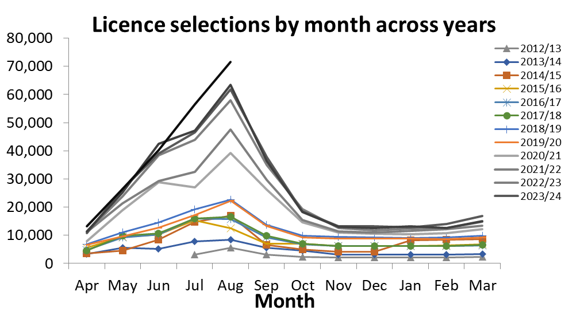
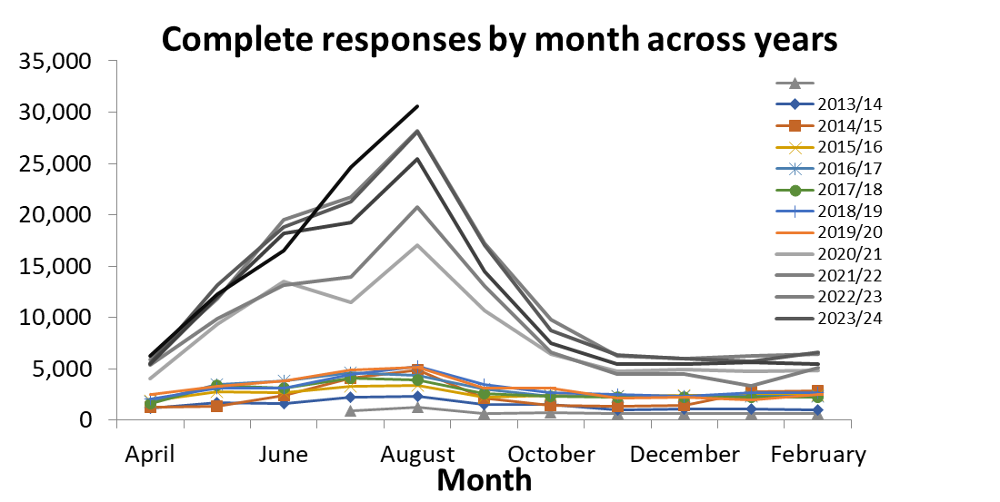

`r if(knitr:::is_latex_output()) '% begin csasdown appendix'` `r if(!knitr:::is_latex_output()) '# (APPENDIX) Appendix {-}'`

\clearpage

# Changes to licence selection methods and analytical stratification in the Internet Recreational Effort and Catch (iREC) Reporting Program {#apdx-irec-mthd}

For 1, 3 and 5 day (“term”) recreational licences, only the selection rate has changed. From 2012 to 20xx, each licence had a 25% chance of being selected to the reporting program. Since 2020, 100% of term licences are selected to report.

Several advancements to how annual recreational licences are selected to report for a given survey month have occurred since the iREC survey began in 2012. The annual licence year runs from April through to the following March, and these and other changes affecting survey operation were timed to take effect at the start of a new licence year. For these annual licences, purchase month is expected to be correlated with how the licence holder fishes. For example, licences bought in May or June are more likely to be used to target Coho and Chinook than those bought in September and October when the purchasers are more likely intending to target shellfish and finfish other than salmon. Accordingly, with each update in the selection approach, we mitigated bias caused by differential representation of licences by purchase month as described below.

Originally, a targeted number of licences was selected by simple random sampling from all licences sold up until immediately prior to the start of a given survey month. This selection represented the “Pre” sample. To ensure representation of fishers with licences purchased within the survey month, a “Post” sample was taken at the end of the survey month. The advantage of taking the Pre sample was that those licence holders could be notified by email prior to the survey onset such that they could report on their fishing through the month with less recall bias. From survey onset in July 2012 through March 2014 licences were vulnerable to selection for a given survey month regardless of whether they had been selected to report for earlier months under the same licence. As expected, some licence holders were selected to report for several months, leading to concerns in such cases over survey fatigue affecting the accuracy of reports for subsequent months, or the likelihood of them even being completed.

In response, as of April 2014, we stopped re-selecting licences. With this change, the sampling approach was adjusted to account for lower representation of licences purchased early in the year as the licence year progressed. Consider using random sampling to select the Pre sample for October. Annual licences bought in April have been depleted by selections to all 6 survey months prior (April through September), while those bought in September had only been depleted by the selections to the September survey. We solved for this by apportioning the overall sample size target for the Pre sample for a given survey month into purchase month targets based on the sales distribution across the months prior to the survey month. For example, if the targeted size for the Pre sample for the October survey was 5000, and 15% of the annual licence sales through the end of September had occurred in April, then our sampling target for April purchases was 750. Those 750 licences were selected randomly from the April purchased licences that had not been selected to an earlier survey month. An alternative approach to protecting against the effect of uneven representation by purchase month, stratifying the analysis by purchase month, was rejected because of the number of strata created, with month and licence type dimensions leading to over 96 strata for the March survey (12 purchase months x 9 licence types). To this point, the analysis to estimate total catches from the responses was stratified by licence type and Pre-vs Post- sample.

In April 2018, we implemented “Instantaneous Licence Selection and Notification”  whereby, during the online licence purchase, the licencing system automatically selected each licence to a particular survey month and notified the purchaser of the selection using a screen ‘pop-up’. Further, the system included on the printed licence the licence holders ‘reporting period’, reporting deadline, and the iREC web address and the purchasers unique AccessID. Previously, this information was only provided by email, and a substantial portion of licence holders do not have valid email addresses in our licencing database or do not receive or read the emails for various reasons; thus, printing this information on the licence ensured all selected licence holders had the information to complete their report. The change to instantaneous selection also meant there was no longer a Post sample; thus, all licences were selected and notified of their selection prior to or at the beginning of their reporting period, such that all selected fishers knew of their reporting requirement and could report fishing throughout their reporting period. While this approach was used, the analysis only needed to be stratified by licence type.

The approaches described so far all relied on equal representation of annual licences by purchase month in the group of licences selected to a given survey month to protect against the bias described above. A consequence of this approach is that the later the purchase month in the licence year, the fewer of the licences could be selected. For example, consider the October survey. If 70% of April purchases had been selected to the preceding 6 survey months, then 70% of the October purchases could not be used for the remaining 6 survey months (October to March), because doing so would over represent October purchasers in those months relative to April purchasers. 

For licence year 2020-21, we changed our selection approach to allow complete selection of licences; this approach has remained in effect through 2025-26. This new approach involves stratifying by purchase period, with up to three purchase period strata, depending on survey month (Figure \@ref(fig:fig-irec-licence-selection)). For every survey month there is one stratum comprised of licences sold in that month; we refer to this stratum as “In-Month Purchases”. In April, that is the only stratum. In May, June and July, there is a second stratum comprised of licences sold prior to the survey month; the selection probabilities for those purchase months to a given survey month are the same. For example, all annual licences sold in April, May and June had a 7% probability of being selected to the July survey (Fig. x). From August on, there is a third stratum, for licences sold from July through the month prior to the survey month (Fig. x); again, note that the selection probabilities from all of those purchase months to a given survey month are the same. The analysis stratification was adjusted to reflect these selection strata, with stratification by licence type and up to three purchase periods, depending on survey month. 

The approach was implemented to improve our precision in two ways. First, we had much larger sample sizes overall, since all licences were able to be selected. Second, treating the In-Month Purchases as a separate stratum likely explains a substantial portion of the overall variation. Purchasers often buy a licence just prior to a planned fishing trip. Thus, In-Month Purchases on average would have more fishing days and higher catches than licences bought prior to the survey month. As well, these licences would more likely target species that are relatively available in the survey month, whereas some of the purchasers of licences in months prior to the survey month would be more focused on other species; for example, August purchasers will tend to be focused on salmon fishing, whereas licences bought in April will include fishers that are interested in fishing for a wider range of species. 


```{r iREC Licence Selection Prob table, results='asis', echo=FALSE}
#| label: tab-irec-licence-selection-prob
#| fig-cap: "Total number of licences (Annual and Term) selected to report for a given survey month, by year from iREC inception in July 2012 through August 2025."

library(gt)

fill_char <- "-"

select_prob_df <-
  data.frame(Purchase_Month = month.abb[c(4:12, 1:3)],
             Apr = c("0.21", rep(fill_char, 11)),
             May = c("0.17", "0.38", rep(fill_char, 10)),
             Jun = c(rep("0.15", 2), "0.53", rep(fill_char, 9)),
             Jul = c(rep("0.07", 3), "0.26", rep(fill_char, 8)),
             Aug = c(rep("0.07", 3), "0.14", "0.40", rep(fill_char, 7)),
             Sep = c(rep("0.07", 3), rep("0.12", 2), "0.52", rep(fill_char, 6)),
             Oct = c(rep("0.06", 3), rep("0.08", 3), "0.60", rep(fill_char, 5)),
             Nov = c(rep("0.04", 3), rep("0.08", 4), "0.68", rep(fill_char, 4)),
             Dec = c(rep("0.04", 3), rep("0.08", 5), "0.76", rep(fill_char, 3)),
             Jan = c(rep("0.04", 3), rep("0.08", 6), "0.84", rep(fill_char, 2)),
             Feb = c(rep("0.04", 3), rep("0.08", 7), "0.92", rep(fill_char, 1)),
             Mar = c(rep("0.04", 3), rep("0.08", 8), "1.00"))

select_prob_df |>
  gt() |>
  tab_style(style = list(cell_text(align = "center")), locations = cells_body()) |>
  tab_style(
    style = list(
      cell_fill(color = "cyan")
    ),
    locations = list(cells_body(columns = Apr, rows = 1),
                     cells_body(columns = May, rows = 2),
                     cells_body(columns = Jun, rows = 3),
                     cells_body(columns = Jul, rows = 4),
                     cells_body(columns = Aug, rows = 5),
                     cells_body(columns = Sep, rows = 6),
                     cells_body(columns = Oct, rows = 7),
                     cells_body(columns = Nov, rows = 8),
                     cells_body(columns = Dec, rows = 9),
                     cells_body(columns = Jan, rows = 10),
                     cells_body(columns = Feb, rows = 11),
                     cells_body(columns = Mar, rows = 12))) |>
    tab_style(
    style = list(
      cell_fill(color = "yellow")
    ),
    locations = list(cells_body(columns = May, rows = 1),
                     cells_body(columns = Jun, rows = 1:2),
                     cells_body(columns = Jul, rows = 1:3),
                     cells_body(columns = Aug, rows = 1:3),
                     cells_body(columns = Sep, rows = 1:3),
                     cells_body(columns = Oct, rows = 1:3),
                     cells_body(columns = Nov, rows = 1:3),
                     cells_body(columns = Dec, rows = 1:3),
                     cells_body(columns = Jan, rows = 1:3),
                     cells_body(columns = Feb, rows = 1:3),
                     cells_body(columns = Mar, rows = 1:3))) |>
    tab_style(
    style = list(
      cell_fill(color = "green")
    ),
    locations = list(cells_body(columns = Aug, rows = 4),
                     cells_body(columns = Sep, rows = 4:5),
                     cells_body(columns = Oct, rows = 4:6),
                     cells_body(columns = Nov, rows = 4:7),
                     cells_body(columns = Dec, rows = 4:8),
                     cells_body(columns = Jan, rows = 4:9),
                     cells_body(columns = Feb, rows = 4:10),
                     cells_body(columns = Mar, rows = 4:11))) |>
    tab_style(
    style = list(
      cell_fill(color = "grey")
    ),
    locations = list(cells_body(columns = Apr, rows = 2:12),
                     cells_body(columns = May, rows = 3:12),
                     cells_body(columns = Jun, rows = 4:12),
                     cells_body(columns = Jul, rows = 5:12),
                     cells_body(columns = Aug, rows = 6:12),
                     cells_body(columns = Sep, rows = 7:12),
                     cells_body(columns = Oct, rows = 8:12),
                     cells_body(columns = Nov, rows = 9:12),
                     cells_body(columns = Dec, rows = 10:12),
                     cells_body(columns = Jan, rows = 11:12),
                     cells_body(columns = Feb, rows = 12))) |>
    cols_label(Purchase_Month = md("Purchase<br>Month")) |>
    tab_style(
      style = list(cell_text(align = "center")),
    locations = list(cells_column_labels(columns = Purchase_Month))) |>
    tab_spanner(label = "Reporting Month", columns = month.abb[c(4:12, 1:3)])

```

```{r iREC Licence Selection appendix, results='asis', echo=FALSE}
#| label: fig-irec-licence-selection
#| fig-cap: "Total number of licences (Annual and Term) selected to report for a given survey month, by year from iREC inception in July 2012 through August 2025."

irec_invites_responses <- read_csv("data/irec_invites_and_responses.csv") %>%
  #add in column to divide into license groups 
  mutate(license_group = case_when(
  year %in% c("2020/21", "2021/22", "2022/23", "2023/24", "2024/25", "2025/26") ~ "group2",
  TRUE ~ "group1")) %>%
  #add in a numerical year category
  mutate(year_numerical = as.numeric(str_extract(year, "^\\d{4}")))

month_order <- c("Apr", "May", "Jun", "Jul", "Aug", "Sep",
                 "Oct", "Nov", "Dec", "Jan", "Feb", "Mar")


irec_invites_graph <- irec_invites_responses %>%
  drop_na() %>%
    mutate(year = as.factor(year),
         month_abb = factor(month_abb, levels = month_order))%>%
  ggplot(aes(x = month_abb, y = invitees, group = year, colour = year)) + 
  geom_line() + 
scale_color_manual(values = c(
  # Group 1 (red): 2012–2019
  "2012/13" = "#fee5d9",  # light red
  "2013/14" = "#fcbba1",
  "2014/15" = "#fc9272",
  "2015/16" = "#fb6a4a",
  "2016/17" = "#ef3b2c",
  "2017/18" = "#cb181d",
  "2018/19" = "#c1151b",
  "2019/20" = "#99000d",

  # Group 2 (blue): 2020–2025
  "2020/21" = "#deebf7",  # light blue
  "2021/22" = "#c6dbef",
  "2022/23" = "#9ecae1",
  "2023/24" = "#6baed6",
  "2024/25" = "#3182bd",
  "2025/26" = "#08519c"   # dark blue
))+
  geom_point() + 
  labs(title = "Licence selections by month across years",
       x = "Month",
       y = "Number of Licence Selections",
       colour = "Year") + 
  theme_bw()
    
irec_invites_graph


```


```{r iREC Complete Survey appendix, results='asis', echo=FALSE}
#| label: fig-irec-licence-response
#| fig-cap: "Completed responses to the iREC surveys, by survey month, by year from iREC inception in July 2012 through August 2025."

irec_responses_graph <- irec_invites_responses %>%
  drop_na() %>%
  select(month_abb, year, responses) %>%
  mutate(year = as.factor(year),
         month_abb = factor(month_abb, levels = month_order))%>%
  ggplot(aes(x = month_abb, y = responses, colour = year, group = year)) + 
  geom_line() + 
  geom_point() + 
  scale_color_manual(values = c(
  # Group 1 (red): 2012–2019
  "2012/13" = "#fee5d9",  # light red
  "2013/14" = "#fcbba1",
  "2014/15" = "#fc9272",
  "2015/16" = "#fb6a4a",
  "2016/17" = "#ef3b2c",
  "2017/18" = "#cb181d",
  "2018/19" = "#c1151b",
  "2019/20" = "#99000d",

  # Group 2 (blue): 2020–2025
  "2020/21" = "#deebf7",  # light blue
  "2021/22" = "#c6dbef",
  "2022/23" = "#9ecae1",
  "2023/24" = "#6baed6",
  "2024/25" = "#3182bd",
  "2025/26" = "#08519c"   # dark blue
))+
   labs(title = "Complete resposes by month across years",
       x = "Month",
       y = "Number of Responses") + 
  theme_bw()

irec_responses_graph


```

\clearpage

# Stratification Mapping {#apdx-strattab}

```{r methods strattab, echo=FALSE, message=FALSE, warning=FALSE}
#| label: tbl-stratatab

strat_table <- 
  sport_catch_area |> 
  distinct(finescale_fishery, area, month) |>
  arrange(finescale_fishery,  area, month)

fishery_map <-
  sport_catch_area |>
  distinct(region, management, finescale_fishery) |>
  mutate(erafishery = case_when(
    region %in% c("SWCVI", "NWCVI") & management == "AABM" ~ "WCVI AABM S",
    region %in% c("NGS", "SGS") ~  "GEO ST S",
    region == "JDF" ~ "BC JF S",
    region == "CBC" ~ "CENTRAL S",
    region == "JNST" ~ "JNST S",
    region %in% c("SWCVI", "NWCVI") & management == "ISBM" ~ "WCVI ISBM S",
    region == "NC" & management == "ISBM" ~ "NBC ISBM S",
    region == "NC" & management == "AABM" ~ "NBC AABM S",
    region == "TSWCVI" ~ "SWCVI TERMINAL",
    .default = NA_character_)) |>
  select(finescale_fishery, erafishery) |>
  distinct()

strat_table <- 
  strat_table |>
  left_join(fishery_map, by = "finescale_fishery") |>
  arrange(erafishery) |> 
  relocate(erafishery) |>
  group_by(erafishery, finescale_fishery, area) |>
  summarize(month_category = paste0(min(month), " to ", max(month)),
            .groups = "drop") |>
  distinct() |> 
  arrange(erafishery, finescale_fishery, area, month_category) |>
  rename("CTC ERA Fishery" = erafishery,  
         "CTC Finescale Fishery" = finescale_fishery, 
         "PFMA" = area,
         "Months" = month_category)


csas_table(strat_table, format = "latex")
#strat_table %>%
#  kableExtra::kable("latex", 
#                    escape = FALSE,
#                    caption = "Stratification mapping",
#                    align = "l") #%>%
#  kableExtra::kable_classic(full_width = F, html_font = "Cambria") %>%
#  kableExtra::kable_styling(bootstrap_options = c("bordered")) %>%
# kableExtra::collapse_rows(columns = 1:3, valign = "middle")


```

\clearpage

# Revised Estimates 2005-2023 {#app:first-appendix}

```{r m plots, results='asis', echo=FALSE}
#| label: fig-catch-revised-1-appendix
#| fig-cap: "Revised yearly kept catch estimates"

### make this by finescale fishery old... sum up. 
models_combined_old<-
  sport_catch_models$model_catch |>
  filter(region %notin% c("CBC", "NC")) |>
  mutate(region_mgmt = if_else(region %in% c("SWCVI", "NWCVI"),
                               paste(region, management),
                               region)) |>
  group_by(year, kept_status, pred_cat, region_mgmt) |> 
  summarise(across(where(is.double), sum, na.rm = TRUE), .groups = "drop")


fishery_name_south <- sort(unique(models_combined_old$region_mgmt))


for (i in 1:length(fishery_name_south)){
  graph_data <- 
    models_combined_old  %>% 
    filter(region_mgmt == fishery_name_south[i],
           between(year, 2005, 2023),
           kept_status == "kept") %>%
    select(year, creel_unfiltered_plus, catch_estimate_predicted) %>%
    pivot_longer(c(creel_unfiltered_plus, catch_estimate_predicted),
                 names_to = "estimate_type",
                 values_to = "catch_estimate")
  
  m <- ggplot(graph_data, aes(y = catch_estimate,
                              x = year,
                              shape = estimate_type,
                              linetype = estimate_type))+
    geom_point(size = 2.5,
               colour = "#440154")+
    geom_line(colour = "#440154") +
    scale_shape_manual(values = c(1, 16),
                       labels = c("iREC included", "Unfiltered creel and logbook")
    ) +
    scale_linetype_manual(values = c(2, 1),
                          labels = c("iREC included", "Unfiltered creel and logbook")
    ) +
    scale_x_continuous(breaks = seq.int(2005, 2023, by = 2)) +
    ggtitle(paste(fishery_name_south[i])) + 
    theme_bw() + 
    ylab("Kept catch estimate") + 
    xlab("Year") +
    labs(linetype = "Catch Estimate", shape = "Catch Estimate")
  
  print(m)
}
```

```{r m plots, results='asis', echo=FALSE}
#| label: fig-catch-revised-2-appendix
#| fig-cap: "revised yearly catch estimates"


### make this by finescale fishery old... sum up. 
models_combined_old2 <-
  sport_catch_models$model_catch |>
  filter(region %in% c("CBC", "NC")) |>
  mutate(region_mgmt = if_else(region == "NC",
                               paste(region, management),
                               region)) |>
  group_by(year, kept_status, pred_cat, region_mgmt) |> 
  summarise(across(where(is.double), sum, na.rm = TRUE), .groups = "drop")

fishery_name_north<- sort(unique(models_combined_old2$region_mgmt))

for (i in 1:length(fishery_name_north)) {
  graph_data <- 
    models_combined_old2  %>% 
    filter(region_mgmt == fishery_name_north[i],
           between(year, 2005, 2023),
           kept_status == "kept") %>%
    select(year, historic_plus, catch_estimate_predicted) %>%
    pivot_longer(c(historic_plus, catch_estimate_predicted),
                 names_to = "estimate_type",
                 values_to = "catch_estimate")
  
  m <- ggplot(graph_data, aes(y = catch_estimate,
                              x = year,
                              shape = estimate_type,
                              linetype = estimate_type)) +
    geom_point(size = 2.5,
               colour = "#440154")+
    geom_line(colour = "#440154") +
    scale_shape_manual(values = c(1, 16),
                       labels = c("iREC included", "Historic")
    ) +
    scale_linetype_manual(values = c(2, 1),
                          labels = c("iREC included", "Historic")
    ) +
    scale_x_continuous(breaks = seq.int(2005, 2023, by = 2)) +
    ggtitle(paste(fishery_name_north[i])) + 
    theme_bw() + 
    ylab("Kept catch estimate") + 
    xlab("Year") +
    labs(linetype = "Catch Estimate", shape = "Catch Estimate")
  
  print(m)
}
```

\clearpage

# Model Residuals {#app:second-appendix}

```{r Modelling summer subsetting appendix, message=FALSE, warning=FALSE, results='hide', echo=FALSE}
#| label: fig-south-sum-residuals
#| fig-cap: "Validation plots for BC South Summer model"

res_gam <- simulateResiduals(sport_catch_models$model_list$south_summer, plot = T, quantreg=T)
```

```{r Modelling spring and fall subsetting appendix, message=FALSE, warning=FALSE, results='hide', echo=FALSE}
#| label: fig-south-sf-residuals
#| fig-cap: "Validation plots for BC South Spring and Fall model"

res_gam <- simulateResiduals(sport_catch_models$model_list$south_season, plot = T, quantreg=T)

```

```{r Modelling nbc aabm subsetting appendix, message=FALSE, warning=FALSE, results='hide', echo=FALSE}
#| label: fig-nbcaabm-residuals
#| fig-cap: "Validation plots for NBC AABM annual model"

res_gam <- simulateResiduals(sport_catch_models$model_list$north_aabm, plot = T, quantreg=T)

```

```{r Modelling summer nbc isbm subsetting appendix, message=FALSE, warning=FALSE, results='hide', echo=FALSE}
#| label: fig-nbcisbm-sum-residuals
#| fig-cap: "Validation plots for NBC ISBM Summer model"

res_gam <- simulateResiduals(sport_catch_models$model_list$north_isbm_summer, plot = T, quantreg=T)

```

```{r Modelling NBC ISBM spring and fall subsetting appendix, message=FALSE, warning=FALSE, results='hide', echo=FALSE}
#| label: fig-nbcisbm-sf-residuals
#| fig-cap: "Validation plots for NBC ISBM Spring and Fall model"

res_gam <- simulateResiduals(sport_catch_models$model_list$north_isbm_season, plot = T, quantreg=T)

```

```{r Modelling CBCsubsetting appendix, message=FALSE, warning=FALSE, results='hide', echo=FALSE}
#| label: fig-cbc-residuals
#| fig-cap: "Validation plots for CBC annual model"

res_gam <- simulateResiduals(sport_catch_models$model_list$central_isbm, plot = T, quantreg=T)

```

\clearpage

# Model Output {#app:third-appendix}

```{r appendix_plotting_function, include = FALSE}
#plotting function that will be used for the next few sections
create_facet_plot <- function(finescale_fishery_name, x_var, plot_data, model_data) {
  # Labels for facets
  status_labels <- c(
    "marked_kept_total" = "Marked Kept Total",
    "marked_released_total" = "Marked Released Total",
    "unmarked_kept_total" = "Unmarked Kept Total",
    "unmarked_released_total" = "Unmarked Released Total"
  )
  
  # Colors for status
  status_colors <- c(
    "marked_kept_total" = "#440154", 
    "marked_released_total" = "#31688e",
    "unmarked_kept_total" = "#35b779",
    "unmarked_released_total" = "#d4be02"
  )
  
  # Filter data for the specific finescale fishery
  filtered_data <- plot_data %>% filter(finescale_fishery == finescale_fishery_name)
  filtered_model_data <- model_data %>% filter(finescale_fishery == finescale_fishery_name)
  
  #check if all catch_estimate values are zero for each status
  #wont want ribbon and line if all data are 0 like in figure 10
  has_nonzero <- filtered_data %>%
    group_by(status) %>%
    summarize(has_nonzero = any(catch_estimate != 0), .groups = "drop")
  
  # Create the plot
  facet_plot <- ggplot(filtered_data, aes_string(x = x_var, y = "catch_estimate", col = "status", fill = "status")) +
    geom_point() +
    theme_bw() +
    scale_size_continuous(range = c(1, 3)) +
    scale_colour_manual(values = status_colors, guide = "none") +
    scale_fill_manual(values = status_colors, guide = "none") +
    xlab("Creel summer catch estimate") +
    ylab("Calibrated iREC-only catch estimate") +
    facet_wrap(~status,
               labeller = labeller(status = status_labels),
               scales = "free")
  
  # Conditionally add geom_line and geom_ribbon for statuses with non-zero data
  for (status in unique(filtered_data$status)) {
    if (has_nonzero %>% filter(status == !!status) %>% pull(has_nonzero)) {
      facet_plot <- facet_plot +
        geom_line(data = filtered_model_data %>% filter(status == !!status),
                  aes_string(y = "fit", x = x_var, col = "status")) +
        geom_ribbon(data = filtered_model_data %>% filter(status == !!status),
                    aes_string(y = "fit", x = x_var, ymin = "right_lwr", ymax = "right_upr", fill = "status"), 
                    alpha = 0.10)
    }
  }
  
  return(facet_plot)
}
```

## Southern BC Summer fisheries

```{r forloop seasonal summer appendix, results='asis', echo=FALSE}
south_summer_model <- sport_catch_models$model_list$south_summer
south_summer_no_nas <- south_summer_model$data

family_set <- family(south_summer_model)
ilink_family_set<- family_set$linkinv


ndata <-
  south_summer_no_nas %>% 
  group_by(status, finescale_fishery, season) %>%  
  tidyr::expand(creel_plus_summer = seq(0, max(creel_plus_summer), length=100)) %>%
  
  
  ## add the fitted values by predicting from the model for the new data
  add_column(fit = predict(south_summer_model, 
                           newdata = ., 
                           type = 'response')) %>%
  bind_cols(setNames(as_tibble(predict(south_summer_model, 
                                       ., 
                                       se.fit = TRUE)[1:2]),
                     c('fit_link','se_link'))) %>%
  mutate(fit_resp  = ilink_family_set(fit_link),
         right_upr = ilink_family_set(fit_link + (2 * se_link)),
         right_lwr = ilink_family_set(fit_link - (2 * se_link)))

fishery_name_south <- sort(unique(south_summer_no_nas$finescale_fishery))

for (i in 1:length(fishery_name_south)){
  
  plot <- create_facet_plot(finescale_fishery_name = fishery_name_south[i], 
                            x_var = "creel_plus_summer", 
                            plot_data = south_summer_no_nas, 
                            model_data = ndata) +
    ggtitle(paste(fishery_name_south[i])) + 
    #changing the y lab
    ylab("IREC-included catch estimate")
  
  print(plot)
}
```

## Southern BC Spring and Fall fisheries

```{r forloop seasonal spring and fall appendix, results='asis', echo=FALSE}

south_season_model <- sport_catch_models$model_list$south_season
south_season_no_nas <- south_season_model$data

family_set <- family(south_season_model)
ilink_family_set<- family_set$linkinv

ndata <-
  south_season_no_nas %>% 
  group_by(status, region_mgmt, finescale_fishery, season) %>%  
  tidyr::expand(creel_plus_summer = seq(0, max(creel_plus_summer), length=100)) %>%
  ## add the fitted values by predicting from the model for the new data
  add_column(fit = predict(south_season_model, newdata = ., type = 'response')) %>%
  bind_cols(setNames(as_tibble(predict(south_season_model, ., se.fit = TRUE)[1:2]),
                     c('fit_link','se_link'))) %>%
  mutate(fit_resp  = ilink_family_set(fit_link),
         right_upr = ilink_family_set(fit_link + (2 * se_link)),
         right_lwr = ilink_family_set(fit_link - (2 * se_link)))


fishery_name_south<- sort(unique(south_season_no_nas$finescale_fishery))

for (i in 1:length(fishery_name_south)){
  
  plot <- create_facet_plot(finescale_fishery_name = fishery_name_south[i], 
                            x_var = "creel_plus_summer", 
                            plot_data = south_season_no_nas, 
                            model_data = ndata) +
    ggtitle(paste(fishery_name_south[i]))
  
  print(plot)
}

```

## Northern BC AABM fisheries

```{r forloop NBC AABM annual appendix, results='asis', echo=FALSE}

north_aabm_model <- sport_catch_models$model_list$north_aabm

family_set <- family(north_aabm_model)
ilink_family_set<- family_set$linkinv

ndata <-
  north_aabm_model$data %>% 
  group_by(status, finescale_fishery, season) %>%  
  tidyr::expand(historic_plus = seq(0, max(historic_plus), length=100)) %>%
  ## add the fitted values by predicting from the model for the new data
  add_column(fit = predict(north_aabm_model, 
                           newdata = ., 
                           type = 'response')) %>%
  bind_cols(setNames(as_tibble(predict(north_aabm_model, 
                                       ., 
                                       se.fit = TRUE)[1:2]),
                     c('fit_link','se_link'))) %>%
  
  mutate(fit_resp  = ilink_family_set(fit_link),
         right_upr = ilink_family_set(fit_link + (2 * se_link)),
         right_lwr = ilink_family_set(fit_link - (2 * se_link)))


fishery_name_north_aabm<- sort(unique(north_aabm_model$data$finescale_fishery))


for (i in 1:length(fishery_name_north_aabm)){
  plot <- create_facet_plot(finescale_fishery_name = fishery_name_north_aabm[i], 
                            x_var = "historic_plus", 
                            plot_data = north_aabm_model$data, 
                            model_data = ndata) +
    ggtitle(paste(fishery_name_north_aabm[i]))
  
  print(plot)
}
```

## Northern BC ISBM Spring and Fall fisheries

```{r forloop NBC ISBM seasonal spring and fall appendix, results='asis', echo=FALSE}


north_isbm_season_model <- sport_catch_models$model_list$north_isbm_season
north_isbm_season_no_nas <- north_isbm_season_model$data

family_set <- family(north_isbm_season_model)
ilink_family_set<- family_set$linkinv

ndata <-
  north_isbm_season_no_nas %>% 
  group_by(status, finescale_fishery, season) %>%  
  tidyr::expand(historic_summer = seq(0, max(historic_summer), length=100)) %>%
  ## add the fitted values by predicting from the model for the new data
  add_column(fit = predict(north_isbm_season_model, 
                           newdata = ., 
                           type = 'response')) %>%
  bind_cols(setNames(as_tibble(predict(north_isbm_season_model, 
                                       ., 
                                       se.fit = TRUE)[1:2]),
                     c('fit_link','se_link'))) %>%
  
  mutate(fit_resp  = ilink_family_set(fit_link),
         right_upr = ilink_family_set(fit_link + (2 * se_link)),
         right_lwr = ilink_family_set(fit_link - (2 * se_link)))


fishery_name_north_isbm<- sort(unique(north_isbm_season_no_nas$finescale_fishery))


for (i in 1:length(fishery_name_north_isbm)){
  
  plot <- create_facet_plot(finescale_fishery_name = fishery_name_north_isbm[i], 
                            x_var = "historic_summer", 
                            plot_data = north_isbm_season_no_nas, 
                            model_data = ndata) +
    ggtitle(paste(fishery_name_north_isbm[i]))
  
  print(plot)
}
```

\clearpage

# Analytical Improvements since February 2025

During the course of developing this technical report and reviewing the `pacRecCatch` package code, several issues were identified subsequent to the catch estimates used for the February 2025 CTC ERA. The more substantial change was to improve the model used for Haida Gwaii, which is described in the "Modified Haida Gwaii Model" section below.  In addition to the Haida Gwaii model, there was various data and method fixes identified in the "Other Analysis Improvements" section below.

## Modified Haida Gwaii Model {#app:haida-appendix}

```{r Setup Haida Gwaii Model appendix data}

#Limit catch to Historic Plus and iRec Calibrated
nbc_aabm <-
  sport_catch_finescale |>
  filter(management == "AABM", region == "NC") |>
  group_by(year, status) |>
  summarize(across(c(historic_plus, irec_calibrated), sum, na.rm=TRUE),
            .groups = "drop") |>
  select(year, status, historic_plus, irec_calibrated) |>
  tidyr::pivot_longer(c(historic_plus, irec_calibrated))


#Incorporate Summer Historic Catch
nbc_aabm <-
  sport_catch_finescale |>
  filter(management == "AABM", region == "NC", season == "summer") |>
  group_by(year, status) |>
  summarize(across(c(historic_summer), sum, na.rm=TRUE),
            .groups = "drop") |>
  select(year, status, historic_summer) |>
  tidyr::pivot_longer(c(historic_summer)) |>
  bind_rows(nbc_aabm) 

season_north_aabm <-
  sport_catch_area |>
  filter(region == "NC",
         management == "AABM") |>
  mutate(season = case_when(between(month, 1,4) ~ "spring",
                            between(month, 5, 9) ~ "summer",
                            between(month, 10, 12) ~ "fall",
                            .default = "")) |>
  mutate(historic_summer = if_else(between(month, 7, 8), coalesce(historic_plus, 0), 0))

historic_summer_df <- 
  season_north_aabm |>
  group_by(year, status) |>
  summarize(historic_summer = sum(historic_summer, na.rm = TRUE), .groups = "drop")

summer_north_aabm <-
  season_north_aabm |>
  filter(season == "summer") |>
  group_by(year, status) |>
  summarize(historic_plus = sum(historic_plus, na.rm = TRUE), 
            catch_estimate  = sum(catch_estimate , na.rm = TRUE), 
            .groups = "drop") |>
  inner_join(historic_summer_df, by = c("year", "status"))


summer_north_aabm_gamma_spec <-
  summer_north_aabm %>%
  filter(between(year, 2015, 2023)) %>%
  glm(formula = catch_estimate + 1 ~ status + historic_summer:status + 1 + historic_summer,
      family=Gamma(link = "log"),
      data = .)


season_df <- data.frame(season = c("spring", "fall"))

historic_summer_season_df <-
  historic_summer_df |>
  cross_join(season_df)

season_north_aabm <-
  season_north_aabm |>
  filter(season != "summer") |>
  group_by(year, status, season) |>
  summarize(historic_plus = sum(historic_plus, na.rm = TRUE), 
            catch_estimate  = sum(catch_estimate , na.rm = TRUE),
            .groups = "drop") |>
  full_join(historic_summer_season_df, by = c("year", "status", "season")) |>
  mutate(historic_plus = coalesce(historic_plus, 0),
         catch_estimate = coalesce(catch_estimate, 0))


season_north_aabm_gamma_spec <-
  season_north_aabm %>%
  filter(year >= 2015) %>%
  glm(formula = catch_estimate + 1 ~ season + status + historic_summer:season +
        1 + historic_summer,
      family=Gamma(link = "log"),
      data = .)


season_north_aabm_full <-
  season_north_aabm %>%
  filter(year < 2015) %>%
  mutate(catch_estimate_adj = predict.glm(season_north_aabm_gamma_spec,
                                          newdata = .,
                                          type = "response")) |>
  bind_rows(filter(season_north_aabm, year >= 2015)) |>
  mutate(catch_estimate_adj = coalesce(catch_estimate_adj, catch_estimate))

summer_north_fit <-
  summer_north_aabm %>%
  filter(year < 2015) %>%
  mutate(catch_estimate_adj = predict.glm(summer_north_aabm_gamma_spec,
                                          newdata =  .,
                                          type = "response"),
         season = "Summer")

```

Before the development of this report, updated recreational catch estimates where need from Canada to support the implementation of mark selective fisheries in the 2025 CTC Exploitation Rate Analysis. Although most of the model structures were exactly the same, the earlier analysis had different models fit for Haida Gwaii (i.e. NBC AABM) based on separate summer and spring/fall model fit.  The predicted catch estimates based on the earlier model forms, using Equations \@ref(eq:haida-prev-summer-model) and \@ref(eq:haida-prev-season-model) with a Gamma log link, are provided in Figure \@ref(fig:fig-prev-season-catch).

\begin{equation} 
C_{total,summer} = C_{historic, summer} + S + C_{historic, summer}:S 
(\#eq:haida-prev-summer-model)
\end{equation}

\begin{equation} 
C_{total,Z} = Z + S + C_{historic, summer}:Z, Z \in (spring, fall) 
(\#eq:haida-prev-season-model)
\end{equation}

As the summer model predictions show in Figure \@ref(fig:fig-prev-season-catch), the estimates of unmarked kept catch is substantially higher then any other values in the time series.  Furthermore, the spring + fall estimates are orders of magnitude smaller then the summer predictions.  Compared to the source catch data shown in Figure \@ref(fig:fig-nbc-aabm-src-catch), the historic catch data does show an increase in the 2005 to 2007 years for both unmarked kept and released catch.  However, that increase is not expected to be a `r round(filter(summer_north_fit, year == 2006, status == "unmarked_kept_total") |> pull(catch_estimate_adj) / filter(summer_north_aabm, year == 2006, status == "unmarked_kept_total") |> pull(historic_plus), digits = 1)` times increase as predicted by the model.  With the early years having historic catch estimates outside the range of values used for the model fit, the Gamma log link used for the model fit would exponentially increase the historic catch to represent the total catch estimate.  As the rest of the time series has a more linear relative expansion, the exponential increase outside the range did not seem appropriate.  This suggests a Gaussian link would better represent values outside of the range of model fit values.


```{r NBC AABM Previous Summer Model Catch appendix, results='asis', echo=FALSE}
#| label: fig-prev-season-catch
#| fig-cap: "Predicted catch estimates from an earlier Haida Gwaii model fit."

season_north_fit <-
  season_north_aabm %>%
  filter(year < 2015) %>%
  mutate(catch_estimate_adj = predict.glm(season_north_aabm_gamma_spec,
                                          newdata = .,
                                          type = "response"),
         season = "Spring+Fall") |>
  group_by(year, status, season) |>
  summarize(catch_estimate_adj = sum(catch_estimate_adj, na.rm = TRUE), .groups = "drop")

status_labels <- c(
  "marked_kept_total" = "Marked Kept Total",
  "marked_released_total" = "Marked Released Total",
  "unmarked_kept_total" = "Unmarked Kept Total",
  "unmarked_released_total" = "Unmarked Released Total"
)

# Colors for status
status_colors <- c(
  "Marked Kept Total" = "#440154", 
  "Marked Released Total" = "#31688e",
  "Unmarked Kept Total" = "#35b779",
  "Unmarked Released Total" = "#d4be02"
)

previous_model_catch <-
  summer_north_fit |>
  bind_rows(season_north_fit) |> 
  mutate(status = gsub("_", " ", status),
         status = tools::toTitleCase(status))

previous_model_catch |>
  ggplot(aes(x = year, y = catch_estimate_adj, color = status)) +
  geom_line(linewidth = 1) +
  geom_point() +
  scale_colour_manual(values = status_colors) +
  facet_wrap(~season, 
             scales = "free", 
             ncol = 2) +
  labs(title = "Previous Haida Gwaii Modelled Catch",
       x = "Year",
       y = "Catch") +
  theme_minimal() + 
  theme(legend.position = "right")
```

```{r NBC AABM Catch Time Series appendix, results='asis', echo=FALSE}
#| label: fig-nbc-aabm-src-catch
#| fig-cap: "Estimate from the historic (i.e. logbook) and iREC catch estimate sources from Haida Gwaii."

nbc_aabm |>
  mutate(name = case_when(name == "historic_summer" ~ "Historic Summer",
                          name == "historic_plus" ~ "Historic",
                          name == "irec_calibrated" ~ "Calibrated iREC",
                          .default = ""),
         status = gsub("_", " ", status),
         status = tools::toTitleCase(status)) |>
  ggplot(aes(x = year, y = value, color = status)) +
  geom_line(linewidth = 1) +
  geom_point() +
  facet_wrap(~ name, nrow = 3) +
  labs(title = "Haida Gwaii Catch Source Time Series",
       color = "Status",
       x = "Year",
       y = "Catch") +
  theme_minimal()

```

```{r NBC AABM New Model Fit appendix, results='asis', echo=FALSE}
all_north_aabm <-
  sport_catch_finescale |>
  filter(grepl("^NORTH AABM S", finescale_fishery)) |>
  group_by(year, status) |>
  summarize(across(c(irec_calibrated, historic_plus), sum, na.rm = TRUE),
            .groups = "drop")

all_north_aabm_predict <-
  all_north_aabm |>
  filter(year < 2015)

fit_north_aabm_no_nas <-
  all_north_aabm |>
  filter(between(year, 2015, 2023)) |>
  mutate(catch_estimate = irec_calibrated)

all_north_aabm_gaussian_spec <-
  glm(formula = catch_estimate + 1 ~ status + 1 + historic_plus,
      data = fit_north_aabm_no_nas)

```

The relationship between historic logbook and iREC catch is expected to be more linear then the previous log link form previously used as logbook estimates have commonly represented the majority of catch.  Furthermore, the 2005 to 2007 logbook catch estimates are out side the range of the fitted years. A new, much simpler generalized linear model was fit using Equation \@ref(eq:haida-new-model) with a Gaussian link that estimates annual historic Haida Gwaii catch ($C_{historic}$) by status ($S$, i.e. kept/release and marked/unmarked).  

\begin{equation} 
C_{total} = C_{historic} + S 
(\#eq:haida-new-model)
\end{equation}


```{r tbl-haida-gwaii-model-fit, results='asis', echo=FALSE}

fit_aic_df <-
  data.frame(Model = c("Original Summer (Gamma Log)", 
                       "Original Spring/Fall (Gamma Log)", 
                       "New Annual (Gaussian)"),
             AIC = c(summer_north_aabm_gamma_spec$aic,
                     season_north_aabm_gamma_spec$aic,
                     all_north_aabm_gaussian_spec$aic))

csasdown::csas_table(fit_aic_df,
                     caption = "AIC for the two original model fits (i.e. Original Summer and Original Spring/Fall) and the new annual gaussian fit.")

```

Although the new model AIC, identified as "New Annual Gaussian Fit" in Table \@ref(tab:tbl-haida-gwaii-model-fit), is only slightly worse at `r round(all_north_aabm_gaussian_spec$aic, 1)` then the previous "Original Summer (Gamma log)" model AIC of `r round(summer_north_aabm_gamma_spec$aic, 1)` it does provide more consistent estimates outside of the model fit range. The new model fit substantially reduces the estimate of unmarked kept catch during the 2005 to 2007 years and increases the estimate of unmarked releases, particularly in 2005 (Figure \@ref(fig:fig-nbc-aabm-catch-diff)). As there is very limited change in the marked kept and released estimate, the new model fit should not substantially change the ERA or CWT estimates.

```{r NBC AABM New Model Predictions appendix, results='asis', echo=FALSE}
#| label: fig-nbc-aabm-new-catch
#| fig-cap: "Updated catch estimate predicted times series based on historic (i.e. logbook)."

all_north_aabm_full <-
  all_north_aabm_predict |>
  mutate(catch_estimate_adj = predict.glm(all_north_aabm_gaussian_spec,
                                          newdata = all_north_aabm_predict,
                                          type = "response")) |>
  bind_rows(fit_north_aabm_no_nas) |>
  mutate(catch_estimate_adj = coalesce(catch_estimate_adj, irec_calibrated))

all_north_aabm_full |>
  group_by(year, status) |>
  summarize(catch_estimate_adj = sum(catch_estimate_adj, na.rm = TRUE), .groups = "drop") |> 
  filter(year < 2015) |>
  mutate(status = gsub("_", " ", status),
         status = tools::toTitleCase(status)) |>
  ggplot(aes(x = year, y = catch_estimate_adj, color = status)) +
  geom_line(linewidth = 1) +
  geom_point() +
  scale_x_continuous(breaks = c(2005, 2008, 2010, 2014)) +
  labs(title = "NBC AABM Catch Source Time Series",
       color = "Status",
       x = "Year",
       y = "Catch") +
  theme_minimal()
```


```{r NBC AABM Catch Diff, results='asis', echo=FALSE}
#| label: fig-nbc-aabm-catch-diff
#| fig-cap: "Catch estimate differences between the previous model and the new model fit for Haida Gwaii"

previous_annual_catch <-
  previous_model_catch |>
  group_by(year, status) |>
  summarize(prev_annual_catch = sum(catch_estimate_adj, na.rm = TRUE),
            .groups = "drop")

catch_diff <-
  all_north_aabm_full |>
  mutate(status = gsub("_", " ", status),
         status = tools::toTitleCase(status)) |>
  select(year, status, new_annual_catch = catch_estimate_adj) |>
  full_join(previous_annual_catch, by = c("year", "status")) |>
  filter(year < 2015) |>
  mutate(catch_diff = new_annual_catch - prev_annual_catch)


# Find max absolute value
max_y <- max(abs(catch_diff$catch_diff))


catch_diff |>
  ggplot(aes(x = year, y = catch_diff, color = status)) +
  geom_line(linewidth = 1) +
  geom_point() +
  coord_cartesian(ylim = c(-max_y, max_y)) +
  scale_x_continuous(breaks = c(2005, 2008, 2010, 2014)) +
  labs(title = "NBC AABM Catch Change Time Series",
       x = "year",
       y = "Catch Difference \n (New Model - Previous Model)") +
  theme_minimal()
```

\clearpage

## Other Analytical Improvements

In addition to redefining the Haida Gwaii model for historic catch, the NBC ISBM model historic catch was updated to extrapolate catch for the 2005 to 2007 period.  The past version of the analysis did not estimate NBC ISBM catch for 2005 to 2007 because no historic catch estimates were provided. To allow the model to estimate those years, we used to average historic catch estimates from 2008 to 2012 to fit the model for the earlier years.  This will allow the historic catch model to estimate total catch for the 2005 to 2007 period in a consistent approach to more recent years.  Furthermore, we no longer rely on the average sample rate of surrounding regions to estimate the CWT sample rate of NBC ISBM in those years.

During a review of the mark rates used to estimate marked and unmarked catch, a couple of issues were found and corrected.  The first was a issue within including historic creel mark rates from 2005 to 2007. The code didn't correctly link the additional data effectively and excluded the mark rate data in some circumstances. The revised code now correctly combines the historic creel mark rate data to more effectively estimate marked vs unmarked catch in southern BC. Furthermore, there regional aggregation of mark rates was using a different definition of regions provide from creel.  The analysis was updated to use a consistent set of regions to estimate regional mark rates when infill for low quality area mark rates.

In the Southwest Vancouver Island (SWVI) ISBM fishery, it was found that data for PFMA 22 was being incorporated into the ISBM catch estimates and model fit.  PFMA 22 is a more terminal area and not anticipated to be have impacts on Chinook indicator stocks identified by the Pacific Salmon Treaty. This is concern with more recent years with the extensive coverage provided by iREC.  We separated the small amount of catch estimated in PFMA 22 as distinct SWVI terminal region so that it not included into the SWVI ISBM model fit or catch estimates.

When reviewing how the quality control flags were handled when combining creel reported areas into to iREC areas we found that the quality control flags were combined incorrectly.  The only iREC area that this affects was PFMA 20 from 2013 to 2019 in some months.  As PFMA 20 is operational covered by two separate creel programs, in some cases part of PFMA 20 may have a quality creel estimate while the other may not.  When combined it would identify the whole PFMA 20 as being a quality creel and potentially use less quality creel data instead of iREC for the whole area. This was fixed an now Juan de Fuca catch has a more consistent relationship with creel over the whole time series of this study.  With the split of PFMA 20 in iREC reporting starting in 2020, this was no longer an issue and quality creel estimates either portion of PFMA 20 can be used as the final catch estimate.


`r if(knitr:::is_latex_output()) '% end csasdown appendix'`


